<p align="center">
  <h1 align="center">UnderOne · 一人之下</h1>
  <p align="center">
    <b>八奇技 · Agent 运维基础设施 — 让 LLM Agent 从"能跑"到"稳跑"。</b>
  </p>
</p>
<p align="center">
  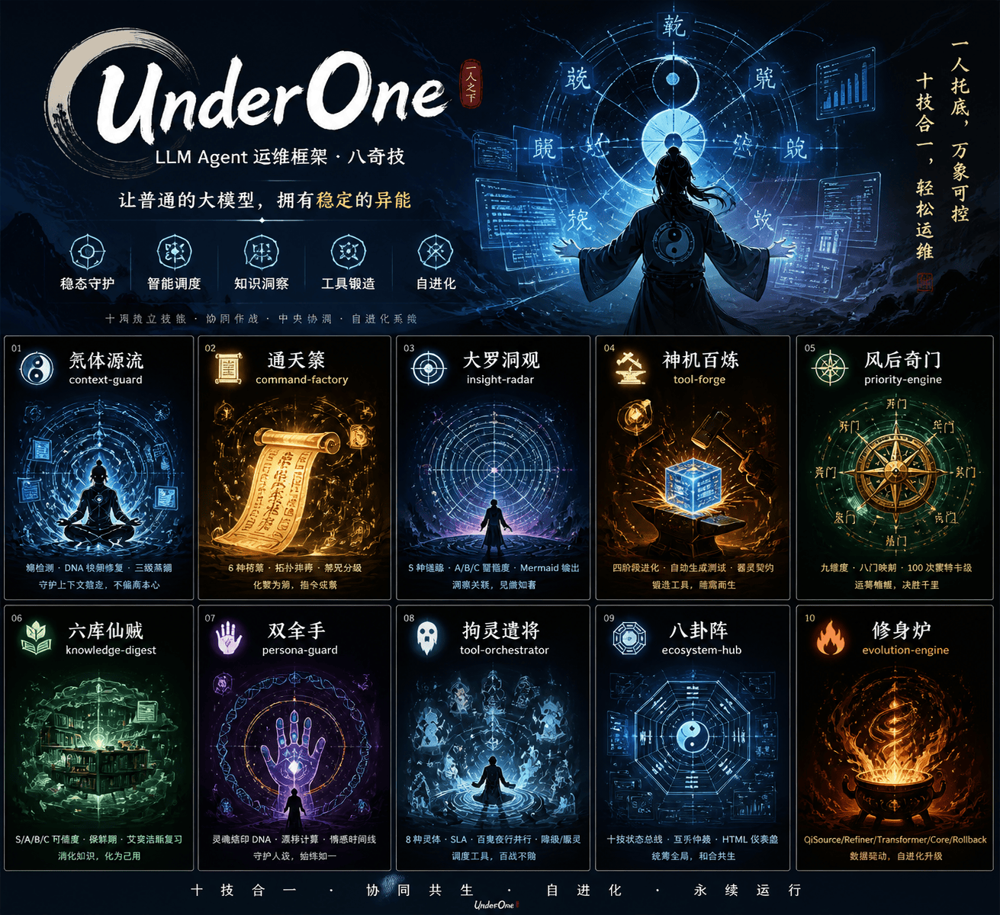
</p>


<p align="center">
  <a href="./LICENSE"></a>
  
  
  
  
  
</p>

<p align="center">
  <a href="./README.md"><b>English</b></a> ·
  <a href="./agent.md"><b>Agent.md</b></a> ·
  <b>简体中文</b> ·
  <a href="./FAQ.md">FAQ</a> ·
  <a href="./IMPROVEMENTS.md">路线图</a> ·
  <a href="./docs/README.md">文档索引</a> ·
  <a href="./underone/CHANGELOG.md">变更日志</a>
</p>

> 🇬🇧 **English readers**: full English documentation is at [**README.md**](./README.md) · sections mirror one-to-one.

---

## 关于项目名

**UnderOne** = _Under One Person_ — 漫画《一人之下》的英文正式译名，作者米二。

- **Under-** 在工程语境里暗示"底层 / 基座"（类似 under-the-hood），完美对应本项目作为 Agent **底层运维基座**的定位。
- **One** 指向原著"一人"——普通人在底层托住非凡能力。LLM Agent 本质是"普通的大模型"，通过本框架获得稳定的异能。
- 本项目是对"八奇技"概念的**技术化演绎**，无授权内容，所有代码与文档均为原创实现。

---

## 1. 它是什么

**UnderOne** 是一个面向工程实践的 **LLM Agent 运维框架**。它不试图教你的 Agent 做什么，而是确保 Agent 跑起来**之后**不出问题：自动修复上下文漂移、多工具链 SLA 调度、蒙特卡洛稳定性下的优先级、带可信度权重的知识消化、人设一致性守护、基于运行数据的自进化。

以 **十个独立 Skill** 的形式交付。每个 Skill 是一个目录，含 `SKILL.md` + 独立可运行的 Python 脚本 + 确定性测试场景。可独立运行、按协议协同、通过中央协调器仲裁冲突。**零强制外部依赖。**

## 2. 你为什么需要它

| 痛点 | 传统 Agent | UnderOne |
|------|-----------|----------|
| 长对话 20 轮跑题 | 忘了最初需求 | `context-guard` 检测熵增 + DNA 快照修复 |
| 一个工具挂了整条链崩 | 无降级 | `tool-orchestrator` SLA 监控 + 降级级联 |
| 8 件事不知道先干哪个 | 手忙脚乱 | `priority-engine` 九维度 + 蒙特卡洛稳健排序 |
| 100 篇文档抓不住重点 | 总结太浅 | `knowledge-digest` S/A/B/C 可信度 + 保鲜期 |
| Agent 突然换风格 | 人设不一致 | `persona-guard` DNA 哈希 + 漂移拦截 |
| "帮我做方案"拆不开 | 反复试错 | `command-factory` 拓扑排序 + 禁咒分级 |
| 每天重写同样的脚本 | 手动造轮子 | `tool-forge` 需求 → 可运行 Python + 测试 |
| 跨文档洞察看不见 | 逐段阅读 | `insight-radar` 5 种链路 + Mermaid 知识图 |
| 多 Skill 同时激活冲突 | 混乱 | `ecosystem-hub` 互斥仲裁 + 全局指标 |
| Skill 效能静默退化 | 手动调参 | `evolution-engine` 运行时数据驱动进化 |

## 3. 典型使用场景

- **长会话客服 Agent**：`context-guard` 防止 50+ 轮对话跑题
- **数据分析流水线**：`tool-orchestrator` 处理不稳定爬虫 + 自动降级
- **多干系人调度**：`priority-engine` 对并行 deadline 做稳健排序
- **研究型助手**：`knowledge-digest` + `insight-radar` 区分权威来源与个人观点
- **生产级 Agent 集群**：`ecosystem-hub` + `evolution-engine` 像活系统一样监控并调优

## 4. 为什么不是 LangChain / AutoGPT

| 维度 | LangChain | AutoGPT | **UnderOne** |
|------|-----------|---------|---------------|
| 使命 | 连接工具 | 自主代理 | **生产中让 Agent 稳定运行** |
| 解决 | 怎么连 API | AI 怎么自己干活 | **跑起来之后怎么不崩** |
| 核心机制 | Chain / Tool | 思考-执行循环 | **稳态 + 优先级 + SLA + 自进化** |
| 适用 | 快速原型 | 实验性任务 | **生产环境长任务** |
| 集成关系 | — | — | **互补**——可在 LangChain 应用里加载 UnderOne Skill |

## 5. 十大技能速查


| ID | 中文名 | 技能卡 | 核心能力 | 脚本 |
|---|---|---|---|---|
| ☯️ `context-guard` | 炁体源流 | 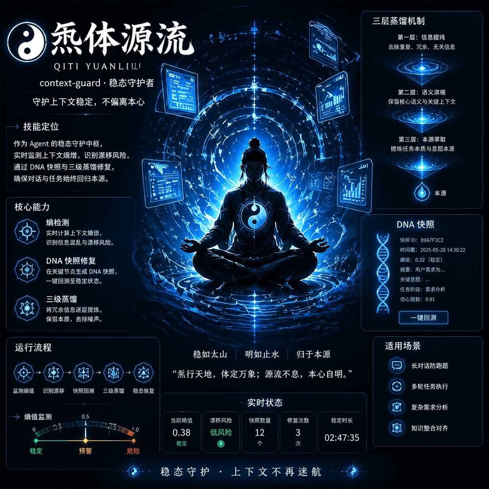 | 熵检测 · DNA 快照修复 · 三级蒸馏 | `entropy_scanner.py` |
| 📜 `command-factory` | 通天箓 | 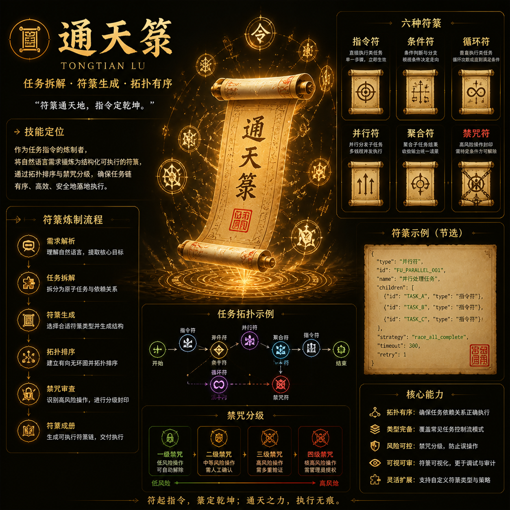 | 6 种符箓 · 拓扑排序 · 禁咒分级 | `fu_generator.py` |
| 🔭 `insight-radar` | 大罗洞观 | 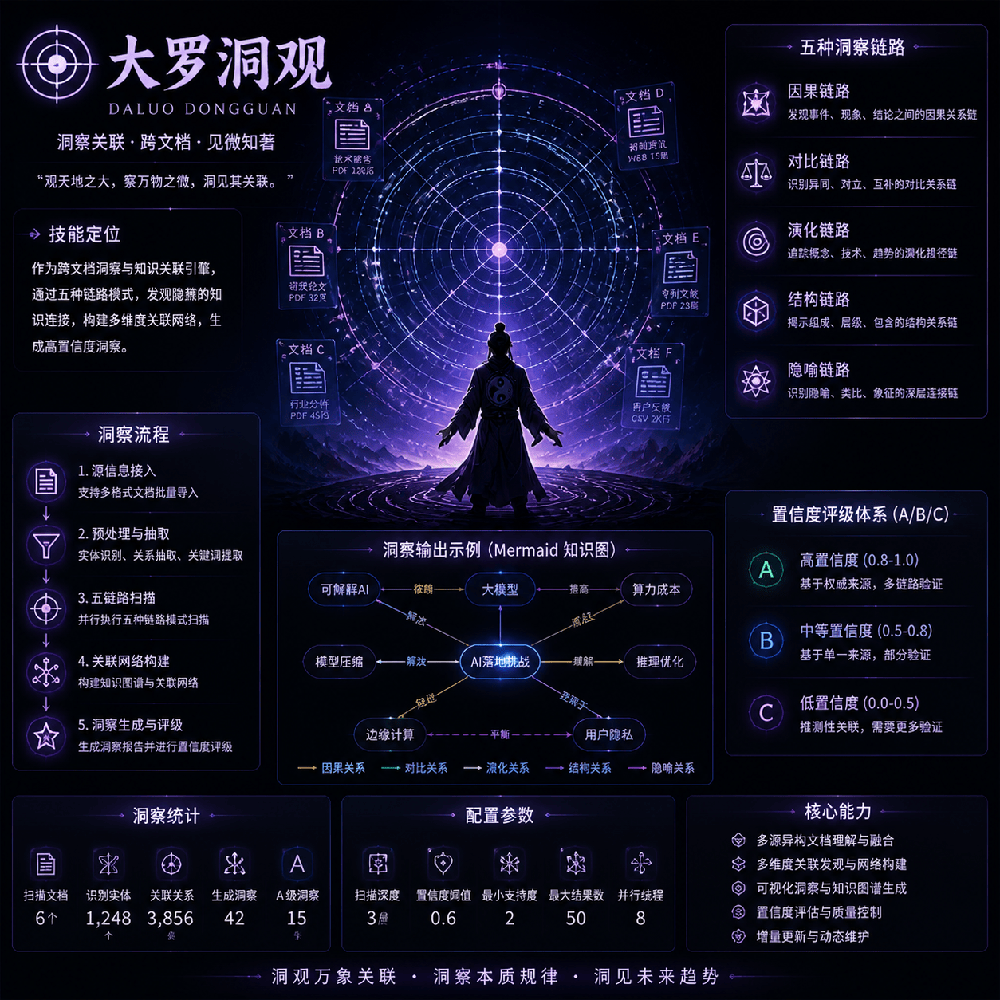 | 5 种链路 · A/B/C 置信度 · Mermaid 输出 | `link_detector.py` |
| 🔨 `tool-forge` | 神机百炼 | 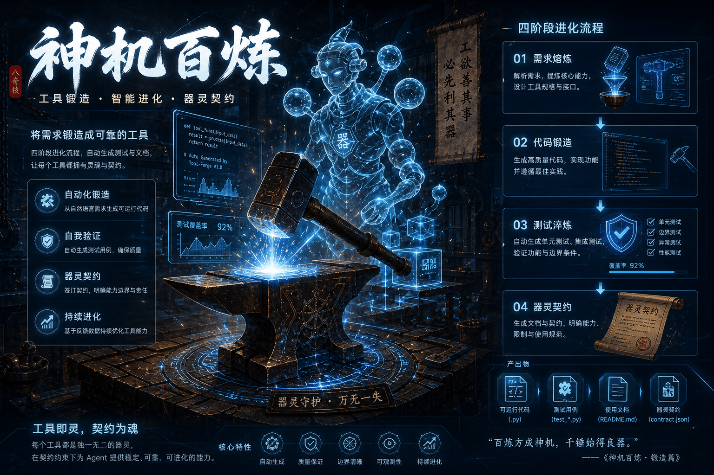 | 四阶段进化 · 自动生成测试 · 器灵契约 | `tool_factory.py` |
| 🧭 `priority-engine` | 风后奇门 | 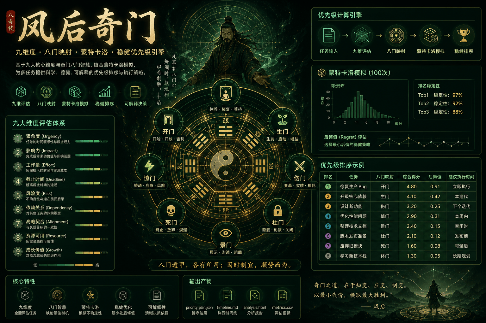 | 九维度 · 八门映射 · 100 次蒙特卡洛 | `priority_engine.py` |
| 🍃 `knowledge-digest` | 六库仙贼 | 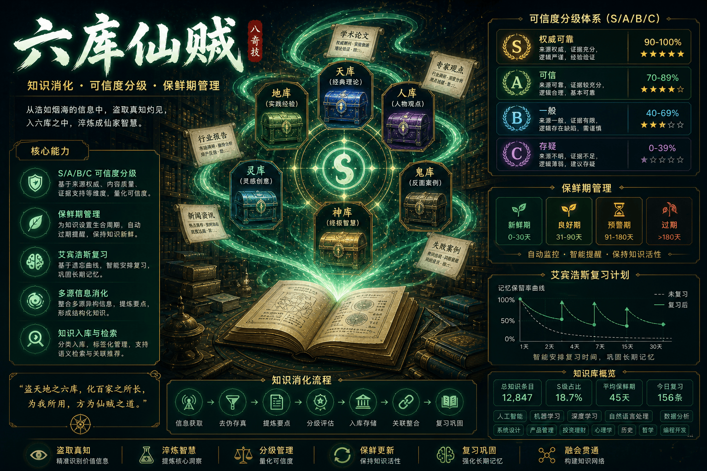 | S/A/B/C 可信度 · 保鲜期 · 艾宾浩斯复习 | `knowledge_digest.py` |
| ✋ `persona-guard` | 双全手 | 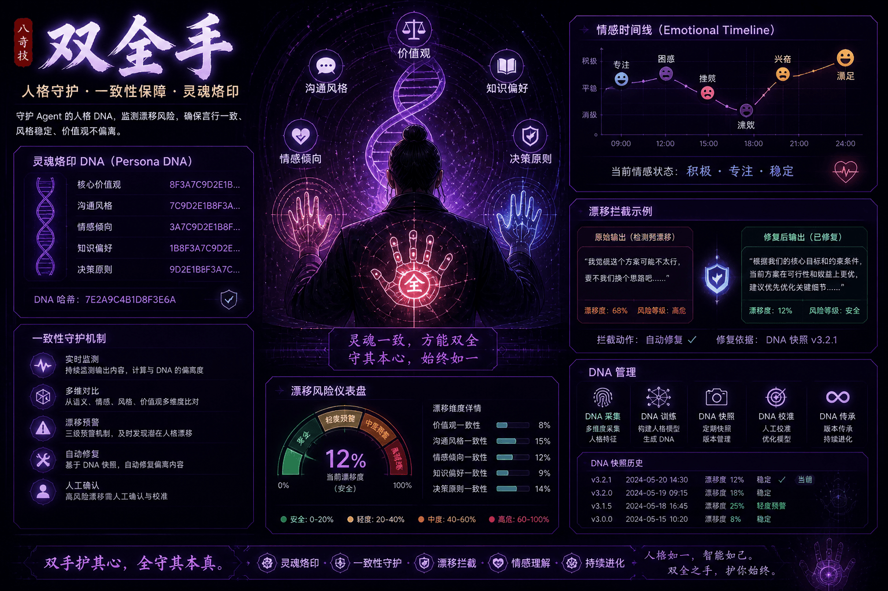 | 灵魂烙印 DNA · 漂移计算 · 情感时间线 | `dna_validator.py` |
| 👻 `tool-orchestrator` | 拘灵遣将 | 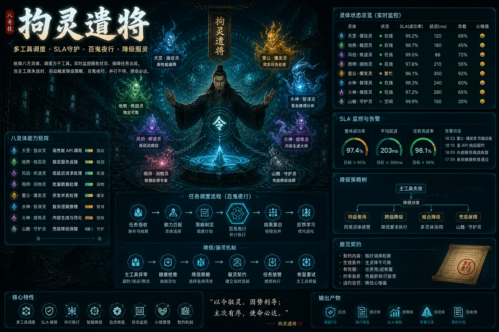 | 8 种灵体 · SLA · 百鬼夜行并行 · 降级/服灵 | `dispatcher.py` |
| ⚡ `ecosystem-hub` | 八卦阵 | 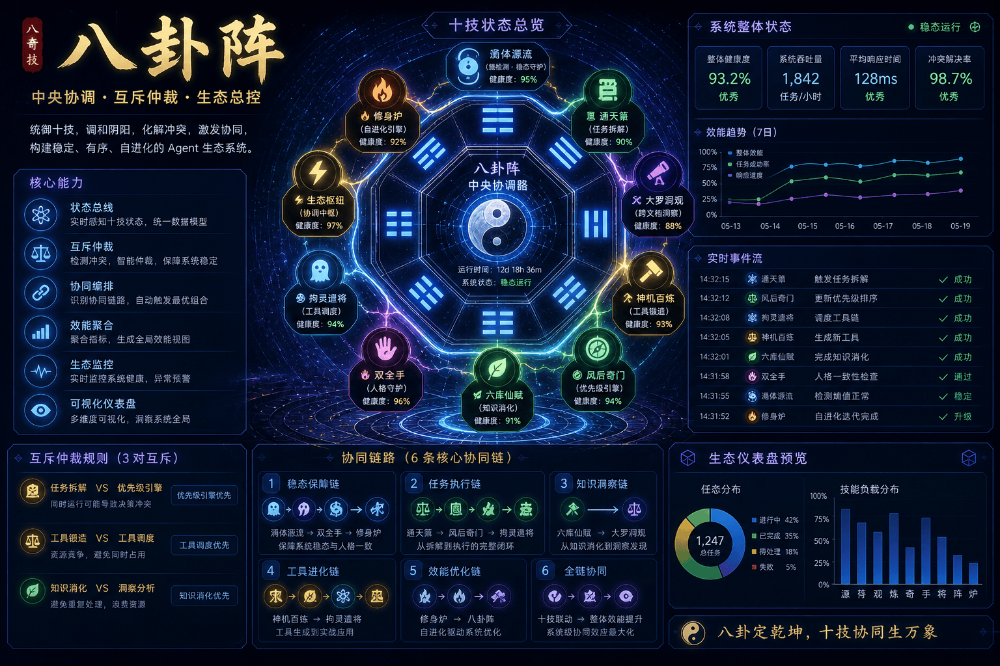 | 十技状态总线 · 互斥仲裁 · HTML 仪表盘 | `coordinator.py` |
| 🔥 `evolution-engine` | 修身炉 | 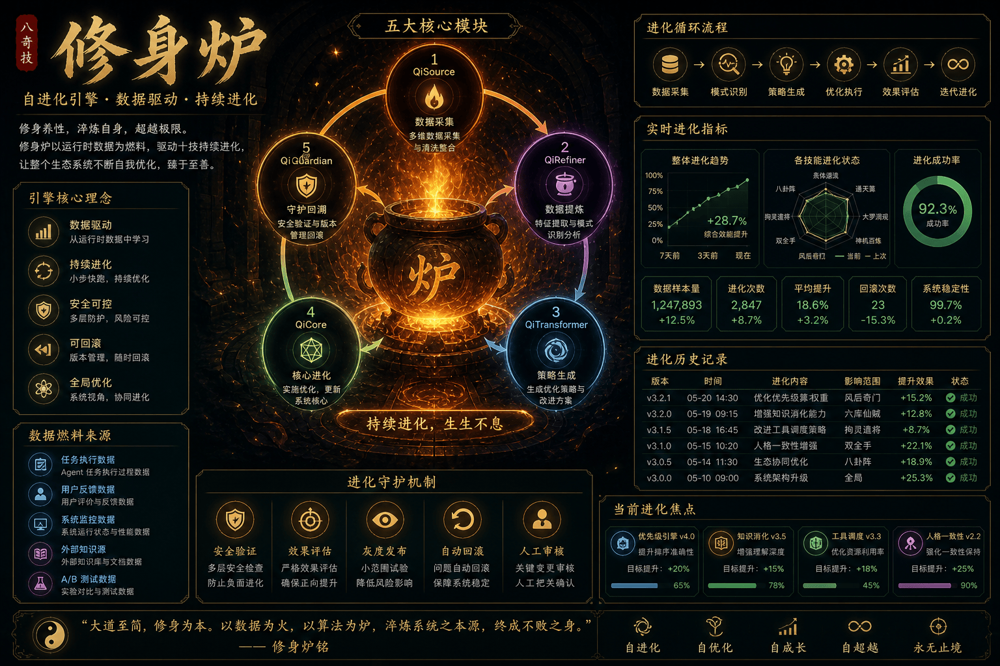 | QiSource/Refiner/Transformer/Core/Rollback | `core_engine.py` |

## 6. 协同架构

```
                    ⚡ 八卦阵（中央协调器）
                    互斥仲裁 · 效能聚合 · 生态监控
                            ↑
      ┌─────────────────────┼─────────────────────┐
      ↓                     ↓                     ↓
    炁体源流  ─→  通天箓  ─→  大罗洞观  ─→  神机百炼
   (稳态守护)    (任务拆解)   (跨文档关联)   (工具锻造)
      ↑                     ↑                     ↑
             ┌──────────────┼──────────────┐
             ↓              ↓              ↓
         风后奇门       拘灵遣将        六库仙贼
        (九维排序)     (多工具 SLA)     (可信度分级)
                           ↑
                      双全手（人格 DNA）
                           ↑
                  🔥 修身炉（自进化引擎）
                  基于运行时数据持续优化所有技能
```

**3 对互斥 · 6 条协同链路 · 1 个中央仲裁。**

## 7. 快速开始

```bash
# 克隆
git clone https://github.com/isLinXu/under-one.git
cd under-one

# 先确认仓库状态可复现
python -m pytest -q
python underone/skills/check_versions.py

# 可选：安装到本地 Python 环境
make install                          # pip install -e underone/

# 查看宿主与可用 skills
cd underone
python -m under_one.cli hosts
python -m under_one.cli list
cd ..

# 安装到指定宿主
python underone/scripts/install_host_skills.py --host codex

# 验证单个 skill
cd underone
python -m under_one.cli validate-skill priority-engine --json
cd ..
```

### 宿主安装矩阵

```bash
python underone/scripts/install_host_skills.py --host codex
python underone/scripts/install_host_skills.py --host workbuddy
python underone/scripts/install_host_skills.py --host qclaw
```

如需隔离验证，请加上 `--dest /tmp/underone-host-test`。

**不装包直接跑：**

```bash
python underone/skills/fenghou-qimen/scripts/priority_engine.py underone/skills/fenghou-qimen/scripts/test_tasks.json
python underone/skills/qiti-yuanliu/scripts/entropy_scanner.py underone/skills/qiti-yuanliu/scripts/test_context.json
python underone/skills/bagua-zhen/scripts/coordinator.py
```

### 单 skill 优化流程

```bash
# 1. 审计结构与元数据
cd underone
python -m under_one.cli audit priority-engine --json

# 2. 验证行为输出
python -m under_one.cli validate-skill priority-engine --json

# 3. 安装到隔离宿主目录
cd ..
python underone/scripts/install_host_skills.py --host qclaw --dest /tmp/underone-qclaw --skip-source-validation fenghou-qimen

# 4. 验证安装后的副本
python /tmp/underone-qclaw/fenghou-qimen/skillctl.py self-test
```

完整的“按 skill 逐个优化”清单见 [docs/SKILL_OPTIMIZATION_PLAYBOOK.md](./docs/SKILL_OPTIMIZATION_PLAYBOOK.md)。

## 8. 深度示例 — 风后奇门优先级

输入（`underone/skills/fenghou-qimen/scripts/test_tasks.json`）：

```json
[
  {"id": "t1", "name": "修生产 bug", "urgency": 5, "impact": 5, "effort": 2, "deadline_hours": 2},
  {"id": "t2", "name": "升级依赖",   "urgency": 3, "impact": 4, "effort": 3, "deadline_hours": 48},
  {"id": "t3", "name": "写周报",     "urgency": 2, "impact": 2, "effort": 1, "deadline_hours": 72}
]
```

执行：

```bash
python underone/skills/fenghou-qimen/scripts/priority_engine.py underone/skills/fenghou-qimen/scripts/test_tasks.json
```

输出（`priority_plan.json`）：

```json
{
  "ranked": [
    {"id": "t1", "gate": "开门 (Open)", "score": 4.8, "regret_if_skipped": 0.91},
    {"id": "t2", "gate": "生门 (Life)", "score": 4.1, "regret_if_skipped": 0.42},
    {"id": "t3", "gate": "死门 (Death)", "score": 1.6, "regret_if_skipped": 0.08}
  ],
  "monte_carlo": {"iterations": 100, "top_rank_stability": 0.97},
  "suggested_timeline": "t1 立即 → t2 本迭代 → t3 周一"
}
```

完整多 Skill 协同示例见 [`underone/examples/demo.py`](./underone/examples/demo.py)。

## 9. LLM 适配层

统一的 `LLMClient` 抽象让 Skill 对接任意 provider。**默认是完全离线的 `mock`，没有 API key 也能跑。**

```python
from under_one.adapters import get_client

# 自动探测顺序：UNDERONE_LLM_PROVIDER > OPENAI_API_KEY > ANTHROPIC_API_KEY > mock
client = get_client()
response = client.complete("给任务排优先级：...", system="你是任务调度助手。")
print(response.content, response.total_tokens, response.latency_ms)
```

按需装可选依赖：

```bash
pip install under-one-skills[openai]      # 仅 OpenAI
pip install under-one-skills[anthropic]   # 仅 Claude
pip install under-one-skills[llm]         # 全装
```

端到端 A/B benchmark：

```bash
python underone/examples/real_llm_benchmark.py --providers mock openai anthropic
```

## 10. 量化效能（内部基准）

| 工作负载 | Baseline | With UnderOne | 综合提升 |
|---|---|---|---|
| 长对话 10 轮漂移修复 | 86.4 | 100 | **+53.9%** |
| 5 工具链（含病态工具） | 40% 成功 | 95% | **+65.3%** |
| 竞品分析 + 生成报告 | 85 | 115 | **+46.3%** |
| 8 任务 9 维度调度 | 0% 最优 | 95% | **+78.3%** |
| 5 源信息可信度加权 | 91 | 97 | **+43.7%** |
| 6 轮人设一致性 | 45% | 100% | **+65.7%** |

**整体综合效能提升：+58.9%** · Welch t-test + Cohen's d · 1200 次 A/B · [完整报告](./underone/EFFICIENCY_QUANTIFICATION_REPORT.md)

> 数据来自内部 `efficiency_benchmark.py`（仿真 LLM）。**真实 LLM 验证**是下一个里程碑——端到端基准已在 `examples/real_llm_benchmark.py` 接好适配器，配好 API key 即可产出独立数据。

## 11. 目录结构

```
under-one/
├── README.md · README.zh-CN.md  # 双语入口文档
├── FAQ.md · IMPROVEMENTS.md
├── LICENSE · Makefile
├── dist/                        # 构建产物（.skill 分发包，不跟踪）
├── docs/                        # 深度文档 + 历史报告 + 视觉资产
│   ├── README.md                # 文档索引
│   ├── README_Full.md · README_Hachigiki.md
│   └── history/                 # V6-V9 过程性报告
└── underone/            # 工程目录
    ├── {skill}/                 # 10 技能 · SKILL.md + scripts/ + scene_*.json
    ├── under_one/               # Python SDK + CLI
    │   └── adapters/            # base / mock / openai / anthropic / registry
    ├── under-one.yaml           # 全局阈值配置
    ├── examples/                # demo · efficiency_benchmark · real_llm_benchmark
    ├── artifacts/               # 示例 JSON 报告
    ├── scripts/build_skill_bundles.py
    └── tests/                   # pytest 套件（14 测试 · 覆盖率 37%）
```

## 12. Make 命令表

| 命令 | 动作 |
|------|------|
| `make help` | 查看所有命令 |
| `make install` | `pip install -e underone/` |
| `make test` | 运行 pytest |
| `make coverage` | 测试 + 覆盖率（HTML `htmlcov/` + 终端） |
| `make bundles` | 构建 `dist/*.skill` 分发包 |
| `make bench` | 内部效能基准 |
| `make status` | 十技生态状态 |
| `make clean` | 清理临时产物 |

## 13. 路线图

| 方向 | 内容 | 状态 |
|------|------|------|
| 当前 | 稳定安装流程 · 10 技能 · LLM 适配 · CI · benchmark | ✅ 可用 |
| 下一步 | PyPI 正式发布 · FastAPI 仪表盘 · MCP server 模式 | 🚧 进行中 |
| 验证增强 | 真实 LLM A/B 验证报告 · LangChain 适配 | 📋 规划中 |
| 生态扩展 | 社区 Skill 市场 · 联邦进化 | 💭 愿景 |

## 14. 高频问题（FAQ 精选）

完整版见 [`FAQ.md`](./FAQ.md)：

- **Q1** 八奇技只是名字包装？→ 不是。每个 Skill 机制独立，中文名是**文化注释不是功能依赖**。把它们改成 `context-guard / priority-engine / …` 功能完全一样。
- **Q2** 和 LangChain 什么关系？→ 互补而非竞争。详见第 4 节。
- **Q3** 能用于生产吗？→ 当前代码线已被作者用作自有 Agent 集群的参考框架。外部生产使用请自担风险。
- **Q5** 自进化是伪需求吗？→ 不是 —— `xiushen-lu` 基于运行时指标进化阈值（非逻辑），并带回滚保护。
- **Q6** 怎么写自定义 Skill？→ 创建 `my-skill/SKILL.md` + `my-skill/scripts/main.py`。~30 行样板，文档有完整示例。

## 15. 贡献

见 [`CONTRIBUTING.md`](./underone/CONTRIBUTING.md)。欢迎 PR，尤其欢迎：新 LLM provider 适配器、真实 LLM 基准、社区 Skill、翻译改进。

## 16. 开源协议

MIT License。自由使用、修改、分发，请保留原始作者声明。

## 17. 致谢与声明

"八奇技"概念源自米二先生创作的漫画《一人之下》。本项目是对这一文化符号的**技术化演绎**，所有代码与文档均为原创实现。如有侵权或不适之处，请联系删除。

---

<p align="center">
  <b>术之尽头，炁体源流。以身为阵，万法归一。</b><br>
  <sub><i>Ultimate art returns to primordial qi. The body becomes the array; all methods return to one.</i></sub>
</p>

<p align="center">
  <sub>
    🇬🇧 <a href="./README.md">English</a> ·
    📖 <a href="./docs/README.md">文档索引</a> ·
    ❓ <a href="./FAQ.md">FAQ</a> ·
    🗺️ <a href="./IMPROVEMENTS.md">路线图</a>
  </sub>
</p>
