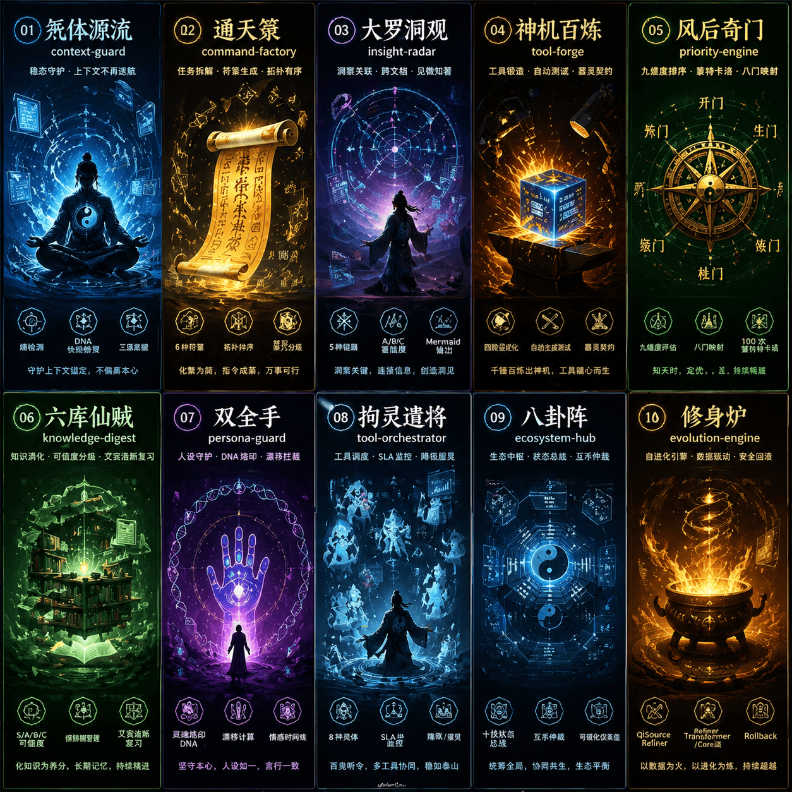

# under-one.skills

> 八奇技 · Agent 运维框架 — 让 LLM Agent 从"能跑"到"稳跑"

[](https://opensource.org/licenses/MIT)

**⚠️ 文化声明**: 本项目中的"八奇技"概念源自米二先生创作的漫画《一人之下》，仅作为技术社区学习交流的文化映射。所有代码与文档均为原创实现。商业使用请自行评估版权风险。

<p align="center">
  
</p>

---

## 一句话介绍

under-one.skills 是一套面向 **LLM Agent 的运维技能框架**。不是提示词模板，不是工作流编排，而是解决 Agent 在真实任务中遇到的 **10 类工程问题**:

| 问题 | 你的痛点 | under-one.skills 的解法 |
|------|---------|-----------------|
| 上下文乱了 | 聊了20轮，Agent忘了你说过什么 | **稳态引擎** — 自动检测矛盾并修复 |
| 多工具崩了 | 一个API挂了，整个任务链崩溃 | **调度中枢** — 降级保护，SLA监控 |
| 任务排不动 | 8件事堆在一起，不知道先干哪个 | **优先级引擎** — 九维度评分+蒙特卡洛 |
| 信息看不过来 | 50页文档，抓不住重点 | **知识消化器** — 可信度分级+保鲜期管理 |
| 人设崩了 | Agent突然换了语气/忘了原则 | **人格守护者** — DNA校验+风格锁定 |
| 想法拆不开 | "帮我做个方案"→不知道怎么拆步骤 | **指令工厂** — 自动拆解为可执行链 |
| 工具找不到 | 每次手写同样的数据处理脚本 | **工具锻造** — 需求→可运行代码 |
| 全局看不见 | 信息分散在10个文件里 | **洞察雷达** — 跨文档关联+Mermaid地图 |
| 多 skill 互相干扰 | 同时开太多能力导致冲突 | **生态中枢** — 互斥检测、关系覆写、全局监控 |
| 调优全靠手工 | 每次升级都要重新试错 | **自进化引擎** — 基于运行数据的阈值与策略演进 |

---

## 视觉导航

先看图，再选 skill，再执行验证命令。插图不是装饰，它们就是这套体系的导航层。

| Stable ID | 插图 | 首先优化什么 | 源目录 |
|------|------|------|------|
| `qiti-yuanliu` |  | 上下文漂移、修复阈值、误报率 | `skills/qiti-yuanliu` |
| `tongtian-lu` |  | 任务拆解、冲突检测、执行顺序 | `skills/tongtian-lu` |
| `dalu-dongguan` |  | 关联质量、幻觉拦截、图谱密度 | `skills/dalu-dongguan` |
| `shenji-bailian` |  | 生成产物质量、测试脚手架、可运行性 | `skills/shenji-bailian` |
| `fenghou-qimen` |  | 排序权重、鲁棒性、主观打分依赖 | `skills/fenghou-qimen` |
| `liuku-xianzei` |  | 消化率、可信度、保鲜期 | `skills/liuku-xianzei` |
| `shuangquanshou` |  | 人设守护、记忆改写边界、污染风险 | `skills/shuangquanshou` |
| `juling-qianjiang` |  | 调度可靠性、降级策略、协作权限 | `skills/juling-qianjiang` |
| `bagua-zhen` |  | 互斥矩阵、生态仲裁、全局监控 | `skills/bagua-zhen` |
| `xiushen-lu` |  | 自适应阈值、回滚保护、数据门槛 | `skills/xiushen-lu` |

## 可复现起步

```bash
# 1. 克隆并进入仓库
git clone https://github.com/isLinXu/under-one.git
cd under-one/underone

# 2. 先确认技能定义和版本是稳定的
python -m pytest -q
python skills/check_versions.py

# 3. 安装到目标宿主
python scripts/install_host_skills.py --host codex
python scripts/install_host_skills.py --host workbuddy
python scripts/install_host_skills.py --host qclaw
python scripts/install_host_skills.py --host custom --dest /path/to/product/skills

# 4. 运行一个 skill（源码侧）
python skills/fenghou-qimen/scripts/priority_engine.py skills/fenghou-qimen/scripts/test_tasks.json
# → 输出: JSON {ranked_tasks, eight_gates, monte_carlo}
```

## 按 skill 逐个优化

先挑一个 skill，再重复同一条路径：

```bash
# 审计源码
python -m under_one.cli audit priority-engine --json

# 验证行为
python -m under_one.cli validate-skill priority-engine --json

# 安装到隔离宿主目录
python scripts/install_host_skills.py --host qclaw --dest /tmp/underone-qclaw --skip-source-validation fenghou-qimen

# 验证同一个目标目录里的安装副本
python /tmp/underone-qclaw/fenghou-qimen/skillctl.py self-test
```

推荐的优化顺序：

1. `qiti-yuanliu`
2. `shuangquanshou`
3. `liuku-xianzei`
4. `tongtian-lu`
5. `fenghou-qimen`
6. `dalu-dongguan`
7. `juling-qianjiang`
8. `shenji-bailian`
9. `bagua-zhen`
10. `xiushen-lu`

---

## 架构速览

```
┌─────────────────────────────────────────────┐
│              八卦阵 (中央协调器)              │
│         互斥仲裁 · 效能聚合 · 生态监控           │
└─────────────────────────────────────────────┘
        ↑                        ↑
   稳态引擎 ◄────► 指令工厂 ◄────► 洞察雷达
  (上下文守护)    (任务拆解)      (全局关联)
        ↑                        ↑
   优先级引擎 ◄────► 调度中枢 ◄────► 工具锻造
  (九维排序)      (多工具SLA)     (代码生成)
        ↑
   知识消化器 ◄────► 人格守护者
  (可信度分级)     (DNA校验)
```

---

## 10个 Skill 速查

| 英文名 | 中文名（彩蛋） | 技能卡 | 一句话能力 | 脚本 |
|--------|-------------|------|-----------|------|
| `context-guard` | 炁体源流 |  | 自动修复上下文漂移 | `entropy_scanner.py` |
| `command-factory` | 通天箓 |  | 一句话拆成可执行步骤 | `fu_generator.py` |
| `insight-radar` | 大罗洞观 |  | 跨文档发现隐藏关联 | `link_detector.py` |
| `tool-forge` | 神机百炼 |  | 需求→可运行 Python 脚本 | `tool_factory.py` |
| `priority-engine` | 风后奇门 |  | 九维度任务优先级排序 | `priority_engine.py` |
| `knowledge-digest` | 六库仙贼 |  | 信息可信度分级 + 保鲜期 | `knowledge_digest.py` |
| `persona-guard` | 双全手 |  | DNA 校验 + 风格漂移拦截 | `dna_validator.py` |
| `tool-orchestrator` | 拘灵遣将 |  | 多工具调度 + 降级保护 | `dispatcher.py` |
| `ecosystem-hub` | 八卦阵 |  | 十技状态监控 + 仲裁 | `coordinator.py` |
| `evolution-engine` | 修身炉 |  | Skill 自进化 + 效能追踪 | `core_engine.py` |

---

## 为什么不是 LangChain / AutoGPT？

| 维度 | LangChain | AutoGPT | under-one.skills |
|------|-----------|---------|-----------|
| **定位** | 工具连接器 | 自主代理 | **代理的运维基础设施** |
| **解决的问题** | 怎么连API | 怎么让AI自己干活 | **Agent跑了之后怎么不崩** |
| **核心机制** | Chain/Tool调用链 | 循环思考-执行 | **稳态自愈+优先级+SLA监控** |
| **适用场景** | 快速搭原型 | 实验性任务 | **生产环境长任务** |

不是替代关系，是**互补**——你可以在 LangChain 应用里加载 under-one.skills skills 来提升稳定性。

---

## 当前稳定特性

- **10 个独立 skill 源目录**，可以分别安装、分别测试、分别验证。
- **同一套源码支持多宿主包装层**：`codex`、`workbuddy`、`qclaw/openclaw`、`custom`。
- **源码、安装包、宿主副本三层都可单独验证**，适合逐 skill 调优。
- **默认保留插图导航层**，方便人读，也方便 agent 在长文档中快速定位能力边界。

---

## 直接运行脚本

以下命令默认在 `underone/` 目录执行。

### 运行单个 Skill

```bash
# 优先级排序（风后奇门）
python skills/fenghou-qimen/scripts/priority_engine.py skills/fenghou-qimen/scripts/test_tasks.json

# 上下文健康扫描（炁体源流）
python skills/qiti-yuanliu/scripts/entropy_scanner.py skills/qiti-yuanliu/scripts/test_context.json

# 任务拆解（通天箓）
python skills/tongtian-lu/scripts/fu_generator.py "分析竞品并生成报告"
```

### 八卦阵全局监控

```bash
python skills/bagua-zhen/scripts/coordinator.py
# → 输出: 十技生态全景报告
```

---

## 技术细节

### 每个 Skill 的交付物

```
skill-name/
├── SKILL.md              # 技能定义 + 触发条件 + 工作流程
└── scripts/
    ├── core_script.py    # 核心执行脚本 (可直接运行)
    └── scene_*.json      # 测试场景数据
```

### 标准化接口

所有脚本遵循统一接口：
- **输入**: 文件路径或标准输入 (JSON / TXT)
- **输出**: 结构化 JSON 报告
- **Metrics**: 自动追加到 `runtime_data/{skill}_metrics.jsonl`

---

## 扩展：添加自定义 Skill

```python
# 1. 创建目录结构
mkdir my-skill/scripts

# 2. 写 SKILL.md (YAML frontmatter + Markdown body)
cat > my-skill/SKILL.md << 'EOF'
---
name: my-skill
description: 我的自定义能力
---
# 我的技能
## 核心工作流
...
EOF

# 3. 写执行脚本
# 输入: sys.argv[1] 或 stdin
# 输出: print(json.dumps(report))
# metrics: 追加到 runtime_data/my-skill_metrics.jsonl

# 4. 打包
python scripts/build_skill_bundles.py my-skill
```

---

## 文档

| 文档 | 内容 |
|------|------|
| [agent.md](../agent.md) | agent 核心入口：元婴、标准动作、稳定 ID、禁止项 |
| [仓库英文入口](../README.md) | 面向外部用户的总览、安装和多宿主说明 |
| [仓库中文入口](../README.zh-CN.md) | 中文主文档，适合直接照着执行 |
| [文档索引](../docs/README.md) | 当前可用深度文档入口 |
| [宿主适配说明](../docs/HOST_ADAPTERS.md) | 内置宿主、OpenClaw 别名、custom 第三方产品 |
| [Skill 优化手册](../docs/SKILL_OPTIMIZATION_PLAYBOOK.md) | 单 skill 优化顺序、验证命令、宿主安装方式 |
| [CHANGELOG.md](./CHANGELOG.md) | 版本演进记录 |
| [CONTRIBUTING.md](./CONTRIBUTING.md) | 贡献规范 |
| [examples/README.md](./examples/README.md) | 示例脚本与基准入口 |
| [artifacts/README.md](./artifacts/README.md) | 示例输出产物说明 |

---

## 路线图

| 方向 | 内容 | 状态 |
|------|------|------|
| 当前重点 | 稳定安装、独立验证、逐 skill 调优 | ✅ |
| 下一步 | Python 包化（`pip install under-one`） | 📋 |
| 验证增强 | 真实 LLM 集成验证（OpenAI / Claude） | 📋 |
| 生态扩展 | 社区贡献的第三方 skill 市场 | 📋 |

---

## License

MIT License — 自由使用、修改、分发。请保留原始作者声明。

---

> 术之尽头，炁体源流。以身为阵，万法归一。
