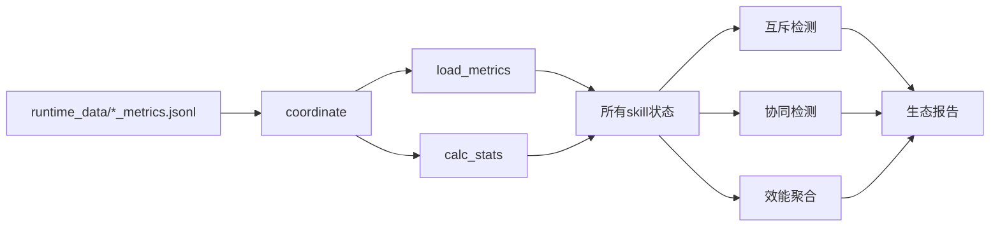

---
metadata:
  name: "bagua-zhen"
  version: "v0.1.0"
  author: "under-one"
  description: "八卦阵 - 生态协调中枢 - 中央监控、互斥仲裁、动态覆写与效能聚合"
  language: "zh"
  tags: ['ecosystem', 'coordinator', 'dashboard', 'monitoring', 'metrics', 'mutex', 'synergy']
  icon: "☯"
  color: "#f0883e"
---

# ☯ 八卦阵 (Bagua-Zhen)

> **生态协调中枢 - 中央监控、互斥仲裁、动态覆写与效能聚合**

## 目录

- [触发词](#触发词)
- [功能概述](#功能概述)
- [架构设计](#架构设计)
- [工作流程](#工作流程)
- [输入输出](#输入输出)
- [核心指标](#核心指标)
- [API接口](#api接口)
- [使用示例](#使用示例)
- [配置说明](#配置说明)
- [错误处理](#错误处理)
- [测试方法](#测试方法)
- [依赖环境](#依赖环境)
- [更新日志](#更新日志)

## 触发词

- 生态监控
- 效能聚合
- 互斥检测
- 协同增益
- 十技全景
- 监控面板
- 生态健康
- 阵法等级
- 技能状态
- 互斥仲裁

## 功能概述

八奇技skill生态系统的中央协调器：扫描所有skill状态、互斥检测与仲裁、效能聚合评分、生成生态健康报告。核心能力：

| 能力 | 说明 |
|------|------|
| 状态扫描 | 读取所有skill的runtime_data指标 |
| 互斥检测 | 检测同时活跃的互斥skill对 |
| 协同检测 | 检测同时活跃的协同skill对 |
| 动态覆写 | 当运行时证据稳定时，可覆盖静态互斥/协同默认矩阵 |
| 效能聚合 | 计算活跃skill的平均质量分 |
| 生态评级 | 阵法大成(≥90) / 稳固(≥75) / 松动 |

### 互斥对（默认）

| 互斥对 | 原因 |
|--------|------|
| tongtian-lu ↔ shenji-bailian | 生成与锻造可能冲突 |
| qiti-yuanliu ↔ fenghou-qimen | 扫描与调度可能干扰 |
| dalu-dongguan ↔ liuku-xianzei | 洞察与消化可能重复 |

### 协同对（默认）

| 协同对 | 增益 |
|--------|------|
| tongtian-lu + dalu-dongguan | 任务拆解后关联分析 |
| juling-qianjiang + shenji-bailian | 调度失败后生成替代工具 |
| qiti-yuanliu + shuangquanshou | 健康检查+人格守护双重保障 |

### V10.3 关系判定规则

- 默认矩阵仍提供“先验关系”
- 若动态证据连续表明某对skill表现为协同，则可覆盖静态互斥
- 控制层skill对（默认 `bagua-zhen ↔ xiushen-lu`）不参与自动互斥推断，避免监控层互相误伤

## 架构设计

### 系统架构



### 文件结构

```
bagua-zhen/
├── SKILL.md              # 本文件
└── scripts/
    └── coordinator.py    # V10生态协调器
```

### 监控的Skill列表

```
qiti-yuanliu    tongtian-lu     dalu-dongguan   shenji-bailian
fenghou-qimen   liuku-xianzei   shuangquanshou  juling-qianjiang
bagua-zhen      xiushen-lu
```

## 工作流程

1. **指标加载**：读取每个skill的 `runtime_data/{skill}_metrics.jsonl`
2. **统计计算**：成功率、质量分、错误数、样本量
3. **互斥检测**：检查互斥对是否同时有运行记录
4. **协同检测**：检查协同对是否同时有运行记录
5. **效能聚合**：计算活跃skill的平均质量分
6. **生态评级**：按平均分映射到阵法等级
7. **报告生成**：输出JSON生态报告

## 输入输出

### 输入

运行时数据目录 `runtime_data/*_metrics.jsonl`，自动扫描。`_skillhub_meta.json` 中声明的输入模式为 `runtime_data/*_metrics.jsonl`：

```
runtime_data/
├── qiti-yuanliu_metrics.jsonl
├── tongtian-lu_metrics.jsonl
├── ...
└── xiushen-lu_metrics.jsonl
```

每条metrics记录格式：
```json
{
  "skill_name": "qiti-yuanliu",
  "timestamp": "2026-05-06T01:30:00",
  "duration_ms": 150,
  "success": true,
  "quality_score": 95.0,
  "error_count": 0,
  "human_intervention": 0,
  "output_completeness": 100,
  "consistency_score": 92.0
}
```

### 输出

主输出文件为 `ecosystem_report_v10.json`，同时会生成 HTML 面板 `hachigiki_v7_dashboard.html`。JSON生态报告格式如下：

```json
{
  "coordinator": "bagua-zhen",
  "version": "v0.1.0",
  "ecosystem_level": "阵法大成",
  "average_quality": 88.5,
  "active_skills": 8,
  "mutex_pairs": [
    ["qiti-yuanliu", "fenghou-qimen"]
  ],
  "synergy_pairs": [
    ["tongtian-lu", "dalu-dongguan"],
    ["juling-qianjiang", "shenji-bailian"]
  ],
  "skill_states": {
    "qiti-yuanliu": {"success_rate": 95.0, "quality": 92.0, "errors": 0.1, "n": 30},
    "...": {}
  },
  "timestamp": "2026-05-06T01:35:00"
}
```

### 控制台输出示例

```
============================================================
☯ under-one.skills V10.3 八卦阵 · 十技生态全景
============================================================

生态状态: 阵法大成 | 平均分: 88.5 | 活跃: 8/10
互斥检测: 1 对skill同时活跃
  ⚠ qiti-yuanliu ↔ fenghou-qimen
协同增益: 2 对skill协同生效
  ✓ tongtian-lu + dalu-dongguan
  ✓ juling-qianjiang + shenji-bailian

Skill                成功率  质量   错误   样本   状态
------------------------------------------------------------
qiti-yuanliu          95%  92.0  0.10   30    活跃
tongtian-lu           90%  88.5  0.20   25    活跃
...
```

## 核心指标

| 指标 | 说明 | 范围 |
|------|------|------|
| ecosystem_level | 生态等级 | 阵法大成/稳固/松动 |
| average_quality | 平均质量 | 0-100 |
| active_skills | 活跃skill数 | 0-10 |
| mutex_pairs | 互斥对列表 | [[a,b], ...] |
| synergy_pairs | 协同对列表 | [[a,b], ...] |
| success_rate | 成功率 | 单skill指标 |
| quality | 质量分 | 单skill指标 |

## API接口

| 接口 | 签名 | 说明 |
|------|------|------|
| 协调 | `coordinate(skills_dir=None) -> dict` | 执行生态协调 |
| 加载指标 | `load_metrics(skill_name) -> list` | 加载skill指标记录 |
| 统计计算 | `calc_stats(records) -> dict` | 计算成功率/质量/错误 |

## 使用示例

### 命令行

```bash
# 使用默认skills目录
python scripts/coordinator.py

# 指定skills目录
python scripts/coordinator.py /path/to/skills

# 输出文件
# → ecosystem_report_v10.json
```

### Python API

```python
from scripts.coordinator import coordinate, load_metrics, calc_stats

# 执行生态协调
report = coordinate()

# 查看生态状态
print(f"生态等级: {report['ecosystem_level']}")
print(f"平均质量: {report['average_quality']}")
print(f"活跃技能: {report['active_skills']}/10")

# 查看互斥
if report["mutex_pairs"]:
    for a, b in report["mutex_pairs"]:
        print(f"⚠️ 互斥: {a} ↔ {b}")

# 查看协同
if report["synergy_pairs"]:
    for a, b in report["synergy_pairs"]:
        print(f"✅ 协同: {a} + {b}")

# 查看单skill状态
for sid, stats in report["skill_states"].items():
    status = "活跃" if stats["n"] > 0 else "休眠"
    print(f"{sid}: 成功率{stats['success_rate']}% 质量{stats['quality']} {status}")

# 加载单个skill的指标
records = load_metrics("qiti-yuanliu")
stats = calc_stats(records)
print(f"qiti-yuanliu: {stats['n']}条记录，成功率{stats['success_rate']}%")
```

## 配置说明

以下配置项支持从 `under-one.yaml` 外部化：

| 配置键 | 默认值 | 说明 |
|--------|--------|------|
| `mutex_pairs` | 见上文 | 互斥skill对列表 |
| `synergy_pairs` | 见上文 | 协同skill对列表 |

详见 [`_skill_config.py`](../../_skill_config.py) 配置加载器。

## 检查点设计

关键决策前需要用户确认：

| 检查点 | 触发条件 | 确认内容 | 默认行为 |
|--------|----------|----------|----------|
| 互斥仲裁 | 检测到互斥对同时活跃 | "检测到 {skill_a} 与 {skill_b} 互斥，是否执行仲裁？" | 报告但不干预 |
| 生态降级 | 平均质量分 < 75 | "生态状态降至'{level}'，是否查看详情？" | 继续运行 |
| 协同激活 | 检测到协同对可激活 | "{skill_a} 与 {skill_b} 可协同，是否输出联动建议？" | 是 |

> 所有检查点支持 `under-one.yaml` 中 `checkpoints: {auto_confirm: true}` 跳过确认。

## 错误处理

| 场景 | 处理方式 |
|------|----------|
| 无metrics文件 | 返回空记录，n=0，视为休眠 |
| JSON解析失败 | 跳过该行，继续处理 |
| 配置加载失败 | 自动回退到硬编码默认值 |

## 测试方法

```bash
# 运行相关测试
python -m pytest underone/tests/test_skills_core.py -v -k "bagua_zhen"

# 快速手动测试（需先有一些metrics数据）
python scripts/coordinator.py
```

## 依赖环境

- Python 3.8+
- 无外部依赖（纯标准库：json, sys, pathlib, datetime）

## 更新日志

| 版本 | 日期 | 变更 |
|------|------|------|
| 10.0 | 历史 | V10发布，互斥/协同检测，配置外部化 |
| 10.1 | 历史 | 支持从under-one.yaml读取互斥/协同矩阵 |
| 10.3 | 当前 | 动态证据可覆盖静态默认矩阵，并忽略控制层自动互斥噪声 |

---

*Generated for under-one.skills framework*
