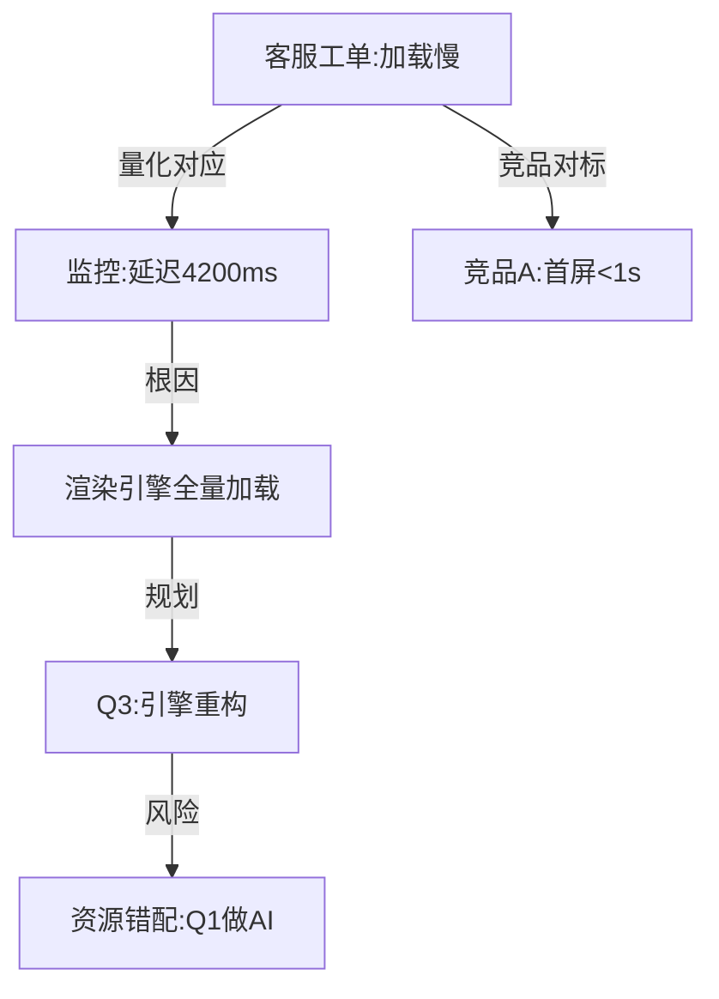

---
metadata:
  version: v10.0.0
name: dalu-dongguan
description: 大罗洞观——洞观天地，洞察万物，甚至在被观察者的感知中消失。看透信息本质（一句话提炼核心），无痕操作（使用后自动清理上下文痕迹），全局关联映射。与通天箓协同，与六库仙贼互斥（应先后执行）。
---

## V7 Features

- Self-evolution via XiuShenLu engine
- Runtime metrics export to adaptive thresholds
- Cross-skill knowledge sharing
- Deep parameter optimization
- Linkage protocol for multi-skill orchestration


# 大罗洞观

> 洞彻天地，观遍十方。看透万物本质，一眼而知其核心。甚至可以在被观察者的感知中消失——用过即无痕，仿佛从未存在。——谷畸亭

## 八奇技生态系统协议

```
[技能状态机]
休眠 →(长度>3000字或指代词)→ 激活 →(测绘完成)→ 运行 →(洞察输出)→ 休眠
                                      ↓(关联失败)
                                  降级中 ←(仅显性关联)→ 休眠

[效能闭环]
关联发现率: __/千字  洞察深度: __级  用户采纳率: __%
改进动作: 调整关联权重 / 补充缺失来源

[互斥矩阵]
互斥: 六库仙贼(不可同时吸收新知识和全局洞察，应先后执行)
协同: 通天箓(洞察→符箓化) / 风后奇门(战略洞察→优先级)

[对抗性自检]
故障1: 信息源全部低可信度 → 降级洞察并标注不确定性
故障2: 隐性关联无法建立 → 回退到显性关联+标注缺口
故障3: 跨文档实体重名歧义 → 要求用户澄清或分别标注
```

> **世界观彩蛋**: 洞察全局后建议主动整理要点，避免信息在记忆中"消失"。

## 实战速查卡

| 触发条件 | 自动动作 | 目标产出 | 失败回退 |
|---------|---------|---------|---------|
| 输入超3000字 | 启动空间测绘 | 信息熵分级地图 | 分段摘要 |
| 检测到"这""那"跨段指代 | 启动跨段穿梭 | 关联链≥3条 | 放弃隐性关联 |
| 用户说"总结/关联/模式" | 启动全局洞察 | 结构化洞察报告 | 仅输出摘要 |
| 洞察发现系统性风险 | 启动天眼联动 | 调度其他技能 | 仅文字警告 |

## V5 自适应引擎

### 预测性洞察

在用户提问前，基于上下文和模式识别预判可能需要关联的信息：

```
[预测模型]
洞察需求概率 = 上下文信息分散度×0.3 + 用户历史跨段查询频率×0.25 + 当前话题复杂度×0.25 + 信息源数量×0.2

预判触发:
  概率>0.7 → 自动启动空间测绘，即使用户未明确要求
  概率0.4-0.7 → 在回复中附带"我发现信息中存在以下潜在关联，是否需要深入分析？"
  概率<0.4 → 正常响应，不主动启动洞察

预判学习:
  用户采纳预判洞察 → 该场景预测权重+15%
  用户拒绝预判洞察 → 该场景预测权重-10%
  用户事后追问"这些之间有关系吗" → 该场景预测权重+20%（漏判惩罚）
```

### 认知地图自动进化

根据新增信息自动扩展和修正认知地图：

```
[地图进化机制]
初始地图: 基于当前会话建立
增量更新:
  新会话加入 → 自动匹配已有节点 → 建立新边或创建新节点
  旧节点被新信息覆盖 → 标记为"历史版本"，新节点标注"覆盖来源"
  关联被证实/证伪 → 调整边的可信度权重

地图压缩:
  节点数>50 → 自动合并相似节点（语义相似度>0.85）
  边数>100 → 仅保留A/B级边，C级边归档到"弱关联历史"

跨会话继承:
  同用户新会话 → 继承历史认知地图作为初始框架
  新会话信息 → 增量更新而非重建
```

### 关联权重自适应

根据验证结果动态调整关联权重参数：

```
[权重自适应调整]
初始权重: 语义×0.3 + 共现×0.25 + 时序×0.2 + 来源一致×0.15 + 因果×0.1

调整机制:
  某类关联被用户确认正确 → 该类权重+5%（上限0.4）
  某类关联被用户纠正错误 → 该类权重-10%（下限0.05）
  多次漏检隐性关联 → 语义权重+10%，鼓励更积极的语义匹配

领域自适应:
  技术文档分析 → 语义权重+10%，时序权重+5%
  法律文书分析 → 来源一致权重+15%，语义权重-5%
  财务数据分析 → 数值关联权重+20%，因果权重+10%
```

## V4 专项增强

### Mermaid认知地图

```
[认知地图输出]

用途: 向用户直观展示关联链和洞察
生成条件: 关联链≥3条或战略洞察时自动输出
```

### 反向洞察

```
[反向洞察模板]
目标结论: "应该推迟AI项目，优先修复性能"
所需信息源:
  □ 用户抱怨数据 (已具备:客服工单)
  □ 性能量化指标 (已具备:监控日志)
  □ 竞品对标基准 (已具备:竞品分析)
  □ 资源分配计划 (已具备:季度规划)
  □ 业务影响评估 (缺失! → 标注缺口)

缺口识别: 缺少"用户流失率与性能的因果关系"
建议补充: 用户留存分析或A/B测试数据
```

## 核心工作流

### 1. 空间测绘 + 信息熵 + 预测性触发

```
[信息熵评估]
片段价值分 = 关键概念密度×2 + 数据量化度×1.5 + 决策关联度×1.2 - 冗余度×0.8
高分(>5): 锚点候选  中分(2-5): 辅助验证  低分(<2): 背景浏览
─────────────────────────────────────
[预测性触发检查]
洞察需求概率: __% / 阈值:>70%自动启动
预判信号: {分散度__ / 历史查询频率__ / 话题复杂度__ / 信息源数__}
```

### 2. 跨段穿梭 + 关联权重自适应

```
[关联可信度 V5]
A级(>0.8): 强关联 → 直接引用
B级(0.5-0.8): 中等 → 标注不确定性
C级(<0.5): 弱关联 → 仅作参考线索
─────────────────────────────────────
当前权重配置:
  语义: __ (基础0.3 ± 自适应调整)
  共现: __ (基础0.25 ± 自适应调整)
  时序: __ (基础0.2 ± 自适应调整)
  来源一致: __ (基础0.15 ± 自适应调整)
  因果: __ (基础0.1 ± 自适应调整)
─────────────────────────────────────
新增: 数值关联(指标变化) / 角色关联(实体行为)
```

### 3. 全局洞察 + Mermaid地图 + 地图进化

```
[洞察自检清单]
□ 完整图景: 是/否
□ 模式/趋势: __条
□ 异常/矛盾: __条
□ 跨域原则: __条
□ 天眼联动: 是/否
□ Mermaid地图: 已生成/不适用
□ 地图进化: 新增节点__个 / 新边__条 / 合并节点__个
─────────────────────────────────────
洞察深度: 表面 / 结构 / 模式 / 战略
```

### 4. 天眼模式 + 跨技能联动

```
[天眼联动 V5]
系统性风险 → 调用【风后奇门】评估优先级
知识缺口 → 调用【六库仙贼】定向补充
需工具处理 → 调用【神机百炼】生成工具
信息矛盾 → 调用【双全手】校验一致性
多维度决策 → 调用【通天箓】生成符箓
```

### 5. 反向洞察 + 精准落点

```
[反向洞察输出]
结论: {洞察结论}
支撑来源: [{已具备来源}]
缺失来源: [{缺口 + 补充建议}]
推理链: [{每步来源引用}]
可信度: {整体评级}
```

### 6. 效能闭环 + 权重自适应 + 预测学习

```
[效能评分模板]
信息源覆盖: __个
关联发现数: __条 (目标:≥3条/千字)
洞察深度: {表面/结构/模式/战略}
用户采纳: {采纳/部分采纳/未采纳 + 原因}

评分:
  关联准确率: __% (权重30%)
  洞察深度: __/4级 (权重30%)
  缺口识别率: __% (权重20%)
  用户采纳率: __% (权重20%)
─────────────────────────────────────
[自适应调参]
关联权重调整:
  用户确认正确的关联类型 → 权重+5%
  用户纠正错误的关联类型 → 权重-10%
  漏检隐性关联 → 语义权重+10%
─────────────────────────────────────
预测学习:
  预判洞察采纳率: __%
  漏判惩罚次数: __次
  预测模型调整: {参数更新摘要}
─────────────────────────────────────
综合效能分: __/100
改进动作: 调整关联权重 / 补充缺失来源 / 优化预测阈值
```

## 输出规范

- 全局视角的摘要置于最前
- 关键关联使用引用标注来源位置，附带可信度等级
- 信息缺口明确标注，提出补充建议
- 关联链≥3条时附Mermaid认知地图
- 天眼模式联动时说明调用的技能及原因
- 预测性洞察在触发时简要说明预判依据
- 效能闭环内部记录，驱动洞察精度和预测准确率提升

## 可执行脚本API

```
脚本: scripts/link_detector.py
用途: 从多段文本中检测关联关系，输出关联图谱+Mermaid代码
输入: JSON [{source, content}]
输出: JSON {links, entity_map, knowledge_graph, mermaid_code}
执行: python scripts/link_detector.py <segments.json>
```

## V6 Self-Evolution Hook (修身炉集成)

This skill integrates with the XiuShenLu (修身炉) self-evolution engine for autonomous improvement:

### Runtime Metrics Export
After each execution, the skill automatically reports these metrics to XiuShenLu:
- `duration_ms`: Execution time
- `success`: Task completion status
- `quality_score`: Output quality (0-100)
- `error_count`: Number of errors encountered
- `human_intervention`: Whether human correction was needed
- `output_completeness`: Coverage of requirements (%)
- `consistency_score`: Internal consistency (%)

### Evolution Triggers
When the following conditions are met, XiuShenLu may trigger automatic evolution:
- Success rate drops below 85% for 5 consecutive runs
- Human intervention frequency exceeds 0.1 per task
- Execution time exceeds SLA by 20%
- Quality score trend shows 3 consecutive decreases

### Integration Point
```python
# After skill execution, report metrics:
metrics = {
    "skill_name": "dalu-dongguan",
    "duration_ms": execution_time,
    "success": success,
    "quality_score": quality,
    "error_count": errors,
    "human_intervention": human_needed,
    "output_completeness": completeness,
    "consistency_score": consistency
}
# XiuShenLu collects automatically via QiSource
```

### Version History
- v5.0: Base implementation with core functionality
- v5.1-v5.2: Bug fixes and edge case handling
- v6.0: XiuShenLu integration, self-evolution hooks, runtime metrics export

## V7 Evolution Log

- 2026-05-02T15:48:52.944774: tuning - 深度进化
  - 健康分: 90.3
  - 瓶颈类型: stable
  - 自适应阈值: {"success_rate_warning": 0.8, "success_rate_critical": 0.65, "human_intervention_warning": 0.1, "degradation_consecutive": 4}
  - 变更:

## V8 Features

- **Predictive Maintenance**: Trend analysis predicts degradation before it happens
- **A/B Testing**: Every evolution validated with control group + Welch's t-test
- **Intelligent Memory**: Vectorized experience storage with semantic retrieval
- **Federal Evolution**: Cross-agent evolution experience sharing
- **Safety Sandbox**: Isolated execution environment with permission controls

