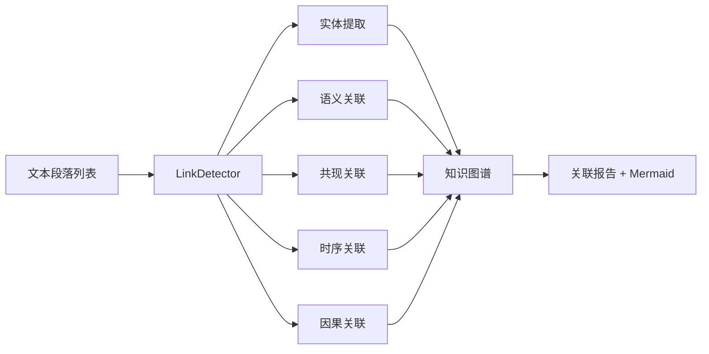

---
metadata:
  name: "dalu-dongguan"
  version: "v0.1.0"
  author: "under-one"
  description: "大罗洞观 - 关联检测器 - 全局洞察与知识图谱构建"
  language: "zh"
  tags: ['link-detection', 'knowledge-graph', 'entity-extraction', 'insight', 'mermaid', 'semantic-analysis', 'configurable']
  icon: "🔭"
  color: "#d2a8ff"
---

# 🔭 大罗洞观 (DaLu-DongGuan)

> **关联检测器 - 全局洞察与知识图谱构建**
>
> **V5.3** — 关联图谱 · 异常信号 · 幻觉风险提示

## 目录

- [触发词](#触发词)
- [功能概述](#功能概述)
- [架构设计](#架构设计)
- [工作流程](#工作流程)
- [输入输出](#输入输出)
- [核心指标](#核心指标)
- [API接口](#api接口)
- [使用示例](#使用示例)
- [配置说明](#配置说明)
- [错误处理](#错误处理)
- [测试方法](#测试方法)
- [依赖环境](#依赖环境)
- [更新日志](#更新日志)

## 触发词

- 检测关联
- 知识图谱
- 实体提取
- 关联分析
- 文本关联
- Mermaid图谱
- 语义相似度
- 时序关系
- 因果关系
- 实体共现

## 功能概述

从多段文本中检测语义关联、共现实体、时序关系和因果关系，输出关联图谱、异常信号、隐藏洞察和 Mermaid 可视化代码。支持5类关系检测：

| 能力 | 说明 | 权重 |
|------|------|------|
| 语义关联 | Jaccard相似度 > 0.3 | 30% |
| 共现实体 | 同一实体出现在多段 | 25% |
| 时序关联 | 时间标记词（首先/然后/最后） | 20% |
| 来源一致 | 同一段落内关联 | 15% |
| 因果关系 | 因果标记词（因为/所以/导致） | 10% |

## 架构设计

### 系统架构



### 文件结构

```
dalu-dongguan/
├── SKILL.md              # 本文件
└── scripts/
    └── link_detector.py  # 关联检测器
```

### 置信度分级

| 等级 | 强度阈值 | 说明 |
|------|----------|------|
| A | > 0.8 | 高置信度 🔒 |
| B | > 0.5 | 中置信度 🔗 |
| C | > 0.3 | 低置信度 📎 |

## 工作流程

1. **实体提取**：正则匹配引号内容、英文大写词、中文技术名词
2. **语义关联**：段段落间Jaccard相似度 > 0.3
3. **共现关联**：同一实体出现在≥2段中
4. **时序关联**：检测到时间标记词时与下一段建立关联
5. **因果关联**：检测到因果标记词时与前一段建立关联
6. **弱关联剪枝**：删除强度 ≤ 0.3 的关联
7. **Mermaid生成**：输出 graph TD 格式的可视化代码

## 输入输出

### 输入

输入文件通常为 `segments.json`，内容是 JSON 段落列表，每段包含来源和内容：

```json
[
  {"source": "A段", "content": "竞品分析显示用户增长放缓"},
  {"source": "B段", "content": "因此我们需要调整产品策略"},
  {"source": "C段", "content": "用户增长放缓与竞品分析相关"}
]
```

### 输出

输出文件为 `link_report.json`，其中包含 JSON 关联报告和 Mermaid 代码：

```json
{
  "detector": "dalu-dongguan",
  "version": "v0.1.0",
  "segment_count": 3,
  "entity_count": 5,
  "link_count": 3,
  "links": [
    {
      "source": "A段",
      "target": "B段",
      "type": "因果关系",
      "strength": 0.5,
      "confidence": "B"
    },
    {
      "source": "A段",
      "target": "C段",
      "type": "语义关联",
      "strength": 0.67,
      "confidence": "B"
    }
  ],
  "entity_map": {
    "竞品分析": ["A段", "C段"],
    "用户增长": ["A段", "C段"]
  },
  "anomaly_signals": [
    {"type": "effect_without_support", "source": "B段", "score": 0.72}
  ],
  "hidden_insights": [
    {"type": "verification_target", "focus": "B段", "confidence": 0.72}
  ],
  "hallucination_risk": {
    "score": 0.58,
    "level": "medium"
  },
  "knowledge_graph": {
    "nodes": ["竞品分析", "用户增长"],
    "edges": [...]
  },
  "mermaid_code": "graph TD\n    A段[A段] -->|因果关系 (B)| B段[B段]\n    ..."
}
```

## 核心指标

| 指标 | 说明 | 阈值 |
|------|------|------|
| entity_count | 提取实体数 | - |
| link_count | 关联数 | 剪枝后 > 0.3 |
| semantic_links | 语义关联 | Jaccard > 0.3 |
| cooccurrence_links | 共现实体关联 | 实体出现 ≥ 2段 |
| temporal_links | 时序关联 | 时间标记词触发 |
| causal_links | 因果关联 | 因果标记词触发 |

## API接口

| 接口 | 签名 | 说明 |
|------|------|------|
| 构造器 | `LinkDetector(segments: list)` | 传入段落列表 |
| 检测 | `.detect() -> dict` | 执行全量关联检测 |
| 实体提取 | `._extract_entities()` | 提取名词短语实体 |
| 语义关联 | `._semantic_links()` | Jaccard相似度关联 |
| 共现关联 | `._cooccurrence_links()` | 实体跨段共现 |
| 时序关联 | `._temporal_links()` | 时间标记词关联 |
| 因果关联 | `._causal_links()` | 因果标记词关联 |
| Mermaid | `._generate_mermaid() -> str` | 生成可视化代码 |

## 使用示例

### 命令行

```bash
python scripts/link_detector.py segments.json

# 输出文件
# → link_report.json
```

### Python API

```python
from scripts.link_detector import LinkDetector
import json

# 加载段落
with open("segments.json", "r", encoding="utf-8") as f:
    segments = json.load(f)

# 创建检测器
detector = LinkDetector(segments)

# 执行检测
result = detector.detect()

# 查看关联
print(f"段落数: {result['segment_count']}")
print(f"实体数: {result['entity_count']}")
print(f"关联数: {result['link_count']}")

for link in result["links"]:
    emoji = {"A": "🔒", "B": "🔗", "C": "📎"}[link["confidence"]]
    print(f"{emoji} [{link['confidence']}] {link['source']} --({link['type']})--> {link['target']}")

# 使用Mermaid代码
print(result["mermaid_code"])
```

## 配置说明

**V5.3**: 全部阈值/权重/关键词从项目根目录 `under-one.yaml` 配置加载，并新增异常信号/幻觉风险输出。

### 可配置项

| 配置节 | 键名 | 默认值 | 说明 |
|--------|------|--------|------|
| `daludongguan.confidence_weights` | semantic | 0.30 | 语义关联权重 |
| `daludongguan.confidence_weights` | cooccurrence | 0.25 | 共现实体权重 |
| `daludongguan.confidence_weights` | temporal | 0.20 | 时序关联权重 |
| `daludongguan.confidence_weights` | source_consistency | 0.15 | 来源一致权重 |
| `daludongguan.confidence_weights` | causal | 0.10 | 因果关联权重 |
| `daludongguan.thresholds` | semantic_similarity | 0.12 | 语义相似度阈值 |
| `daludongguan.thresholds` | source_similarity | 0.15 | 来源相似度阈值 |
| `daludongguan.thresholds` | link_prune | 0.3 | 关联剪枝阈值 |
| `daludongguan.thresholds` | entity_min_length | 2 | 实体最小长度 |
| `daludongguan.thresholds` | entity_max_length | 25 | 实体最大长度 |
| `daludongguan.thresholds` | entity_max_count | 40 | 最大实体数 |
| `daludongguan.confidence_levels` | A | 0.8 | 置信度A阈值 |
| `daludongguan.confidence_levels` | B | 0.5 | 置信度B阈值 |
| `daludongguan.temporal_markers` | - | 见YAML | 时间标记词 |
| `daludongguan.causal_markers` | cause | 见YAML | 因标记词 |
| `daludongguan.causal_markers` | effect | 见YAML | 果标记词 |
| `daludongguan.invalid_words` | - | 见YAML | 排除词列表 |
| `daludongguan.noun_suffixes` | - | 见YAML | 名词后缀列表 |
| `daludongguan.noun_prefixes` | - | 见YAML | 名词前缀列表 |

### 配置文件位置

```
项目根目录/
└── under-one.yaml          # 全局配置，包含 daludongguan 节
underone/skills/
├── _skill_config.py       # 配置加载器（自动查找）
└── dalu-dongguan/
    └── scripts/
        └── link_detector.py  # 从 under-one.yaml 读取配置
```

### 配置覆盖优先级

1. `under-one.yaml` 中的 `daludongguan` 节
2. 代码中的默认值（硬编码回退）

## 检查点设计

关键决策前需要用户确认：

| 检查点 | 触发条件 | 确认内容 | 默认行为 |
|--------|----------|----------|----------|
| 弱关联剪枝 | 准备删除强度 <= 0.3 的关联 | "将删除 {n} 条弱关联(强度<=0.3)，是否确认？" | 是 |
| 实体合并 | 检测到相似实体(相似度>0.8) | "是否将 '{entity_a}' 与 '{entity_b}' 合并？" | 否 |
| Mermaid生成 | 关联数 > 50 | "关联数较多({n})，Mermaid可能难以阅读，是否生成？" | 是 |

## 错误处理

| 场景 | 处理方式 |
|------|----------|
| 无参数 | CLI显示用法说明并exit 1 |
| 空段落列表 | entity_count=0, link_count=0 |
| JSON解析失败 | 抛出标准json.JSONDecodeError |
| 无关联 | 返回空links列表，Mermaid只有graph TD头 |

## 测试方法

```bash
# 运行相关测试
python -m pytest underone/tests/test_skills_core.py -v -k "dalu_dongguan"

# 快速手动测试
python scripts/link_detector.py <(echo '[{"source":"A","content":"因为性能问题"},{"source":"B","content":"所以优化代码"}]')
```

## 依赖环境

- Python 3.8+
- 无外部依赖（纯标准库：json, sys, re, pathlib, collections）

## 更新日志

| 版本 | 日期 | 变更 |
|------|------|------|
| 5.3 | 当前 | **风险洞察增强**: 新增 anomaly_signals、hidden_insights、hallucination_risk，适合 Agent 做核验与追问 |
| 5.2 | 2026-05-11 | **配置化重构**: 全部阈值/权重/关键词从 under-one.yaml 加载，版本号同步至V5.2 |
| 5.1 | - | V5.1升级：实体提取模式匹配、时序/因果关联增强、来源一致性检测、Mermaid丰富 |
| 5.0 | - | V5发布，5类关联检测 |

---

*Generated for under-one.skills framework*
