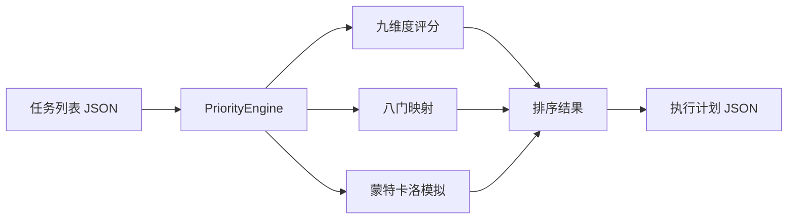

---
metadata:
  name: "fenghou-qimen"
  version: "v0.1.0"
  author: "under-one"
  description: "风后奇门 - 优先级引擎 - 九维度评分、八门映射、蒙特卡洛鲁棒性评估与动态权重模板"
  language: "zh"
  tags: ['priority', 'scheduling', 'task-ranking', 'monte-carlo', 'eight-gates', 'robustness', 'configurable-weights']
  icon: "🧭"
  color: "#ff7b72"
---

# 🧭 风后奇门 (FengHou-QiMen)

> **优先级引擎 - 九维度评分、八门映射、蒙特卡洛鲁棒性评估与动态权重模板**

## 目录

- [触发词](#触发词)
- [功能概述](#功能概述)
- [架构设计](#架构设计)
- [工作流程](#工作流程)
- [输入输出](#输入输出)
- [核心指标](#核心指标)
- [API接口](#api接口)
- [使用示例](#使用示例)
- [配置说明](#配置说明)
- [错误处理](#错误处理)
- [测试方法](#测试方法)
- [依赖环境](#依赖环境)
- [更新日志](#更新日志)

## 触发词

- 任务优先级
- 任务排序
- 八门排盘
- 优先级评分
- 执行计划
- 蒙特卡洛
- 九维度评估
- 鲁棒性测试
- 资源缓冲
- 任务调度

## 功能概述

对多个任务进行九维度综合评分，映射到八门（开门/生门/景门/杜门/死门），通过蒙特卡洛模拟评估执行计划的鲁棒性，输出带操作建议的执行计划。

**V5.1 新增**：权重、阈值、蒙特卡洛参数全部可配置，支持动态权重模板（紧急优先型、质量优先型、资源受限型、团队驱动型、平衡型）。

### 九维度评分模型

| 维度 | 权重 | 字段名 |
|------|------|--------|
| 紧急度 | 25% | urgency | 默认权重，可通过配置调整 |
| 重要度 | 35% | importance / important | 默认权重，可通过配置调整 |
| 依赖复杂度 | 15% | dependency | 默认权重，可通过配置调整 |
| 资源匹配 | 10% | resource_match | 默认权重，可通过配置调整 |
| 时间压力 | 10% | deadline_pressure + dependency_ready + window | 默认权重，可通过配置调整 |
| 环境就绪 | 5% | context_ready + tool_available + tech_debt | 默认权重，可通过配置调整 |
| 团队匹配 | 5% | skill_match + stakeholder_support + history_success | 默认权重，可通过配置调整 |

### 八门映射

| 分数范围 | 八门 | 操作建议 |
|----------|------|----------|
| 4.5+ | 开门 | 立即启动 |
| 4.0-4.5 | 生门 | 重点推进 |
| 3.2-4.0 | 景门 | 审视后执行 |
| 2.5-3.2 | 杜门 | 绕过障碍/延后 |
| < 2.5 | 死门 | 终止释放资源 |

## 架构设计

### 系统架构



### 文件结构

```
fenghou-qimen/
├── SKILL.md              # 本文件
└── scripts/
    └── priority_engine.py    # 优先级引擎
```

### 蒙特卡洛模型

```
100次模拟
  → 每次：所有任务耗时 ±20% 随机扰动
  → 统计按时完成率
  → 评估：高鲁棒(>80%) / 中鲁棒(>60%) / 低鲁棒
```

## 工作流程

1. **解析输入**：读取任务列表JSON
2. **九维度评分**：计算每个任务的综合得分
3. **八门映射**：根据得分映射到对应八门
4. **蒙特卡洛模拟**：100次随机扰动模拟
5. **生成计划**：为每个任务分配操作建议
6. **缓冲建议**：根据按时完成率推荐资源缓冲

## 输入输出

### 输入

输入文件通常为 `tasks.json`，内容是 JSON 任务列表，支持完整九维度和简化输入：

```json
[
  {
    "name": "重构登录模块",
    "urgency": 5,
    "importance": 5,
    "dependency": 4,
    "resource_match": 5,
    "deadline_pressure": 5,
    "dependency_ready": 4,
    "window": 5,
    "context_ready": 4,
    "tool_available": 5,
    "tech_debt": 3,
    "skill_match": 5,
    "stakeholder_support": 4,
    "history_success": 5,
    "estimated_time": 120
  },
  {
    "name": "更新文档",
    "urgency": 2,
    "importance": 3,
    "estimated_time": 30
  }
]
```

### 输出

输出文件为 `priority_plan.json`，格式如下：

```json
{
  "engine": "fenghou-qimen",
  "version": "v0.1.0",
  "task_count": 2,
  "active_template": "balanced",
  "weights_used": {
    "urgency": 0.25,
    "importance": 0.35,
    "dependency": 0.15,
    "resource_match": 0.10,
    "time_pressure": 0.10,
    "environment_readiness": 0.05,
    "team_match": 0.05
  },
  "ranked_tasks": [
    {"name": "重构登录模块", "composite_score": 4.85, "gate": "开门", ...},
    {"name": "更新文档", "composite_score": 2.35, "gate": "死门", ...}
  ],
  "execution_plan": [
    {"task": "重构登录模块", "score": 4.85, "gate": "开门", "action": "立即启动", "estimated_time": 120},
    {"task": "更新文档", "score": 2.35, "gate": "死门", "action": "终止释放资源", "estimated_time": 30}
  ],
  "monte_carlo": {
    "simulations": 100,
    "on_time_rate": 72.5,
    "assessment": "中鲁棒"
  },
  "buffer_recommendation": "增加20%应急资源"
}
```

## 核心指标

| 指标 | 说明 | 范围 |
|------|------|------|
| composite_score | 综合评分 | 0-5 |
| gate | 八门映射 | 开门/生门/景门/杜门/死门 |
| on_time_rate | 按时完成率 | 蒙特卡洛模拟结果 |
| assessment | 鲁棒性评估 | 高鲁棒/中鲁棒/低鲁棒 |
| buffer_recommendation | 缓冲建议 | 基于按时完成率 |

## API接口

| 接口 | 签名 | 说明 |
|------|------|------|
| 构造器 | `PriorityEngine(tasks: list, template: str = None)` | 传入任务列表，可选权重模板（如 `urgency_priority`） |
| 执行 | `.run() -> dict` | 执行评分、排盘、模拟，返回完整报告 |
| 配置加载 | `._load_config(template)` | 从 `under-one.yaml` 加载权重、阈值、模板 |
| 评分 | `._score_all()` | 九维度综合评分（使用配置权重） |
| 八门 | `._assign_gates()` | 分数到八门映射（使用配置阈值） |
| 蒙特卡洛 | `._monte_carlo()` | 鲁棒性模拟（使用配置参数） |
| 计划 | `._build_plan() -> dict` | 生成执行计划（使用配置阈值） |
| 评分 | `._score_all()` | 九维度综合评分 |
| 八门 | `._assign_gates()` | 分数到八门映射 |
| 蒙特卡洛 | `._monte_carlo()` | 100次鲁棒性模拟 |
| 计划 | `._build_plan() -> dict` | 生成执行计划 |

## 使用示例

### 命令行

```bash
# 默认权重（平衡型）
python scripts/priority_engine.py tasks.json

# 使用动态权重模板
python scripts/priority_engine.py tasks.json urgency_priority
python scripts/priority_engine.py tasks.json quality_priority
python scripts/priority_engine.py tasks.json resource_limited
python scripts/priority_engine.py tasks.json team_driven

# 输出文件
# → priority_plan.json
```

### Python API

```python
from scripts.priority_engine import PriorityEngine
import json

# 加载任务
with open("tasks.json", "r", encoding="utf-8") as f:
    tasks = json.load(f)

# 使用动态权重模板
engine = PriorityEngine(tasks, template="urgency_priority")

# 执行排盘
result = engine.run()

# 查看结果
print(f"任务数: {result['task_count']}")
print(f"使用模板: {result['active_template']}")
print(f"权重配置: {result['weights_used']}")
print(f"按时完成率: {result['monte_carlo']['on_time_rate']}%")
print(f"鲁棒性: {result['monte_carlo']['assessment']}")
print(f"建议: {result['buffer_recommendation']}")

# 查看执行计划
for item in result["execution_plan"]:
    emoji = {"开门":"🟢","生门":"🟢","景门":"🟡","杜门":"🟠","死门":"🔴"}[item["gate"]]
    print(f"{emoji} [{item['gate']}] {item['task']} 得分:{item['score']} -> {item['action']}")
```

## 配置说明

引擎支持从 `under-one.yaml` 配置文件加载全部参数，无需修改代码即可调整评分策略。

### 配置位置

编辑项目根目录的 `under-one.yaml`，在 `fenghouqimen:` 节下配置：

```yaml
fenghouqimen:
  # 蒙特卡洛参数
  monte_carlo_simulations: 100
  time_variance: 0.2
  default_estimated_time: 30
  on_time_multiplier: 1.2
  
  # 鲁棒性评估阈值
  robustness_high: 80
  robustness_medium: 60
  
  # 缓冲建议阈值
  buffer_threshold: 80
  buffer_recommendation_low: "增加20%应急资源"
  buffer_recommendation_high: "无需额外缓冲"
  
  # 八门阈值映射
  gates:
    开门: [4.5, 999]
    生门: [4.0, 4.5]
    景门: [3.2, 4.0]
    杜门: [2.5, 3.2]
    死门: [0.0, 2.5]
  
  # 九维度权重配置
  weights:
    urgency: 0.25
    importance: 0.35
    dependency: 0.15
    resource_match: 0.10
    time_pressure: 0.10
    environment_readiness: 0.05
    team_match: 0.05
  
  # 动态权重模板
  weight_templates:
    balanced:
      urgency: 0.25
      importance: 0.35
      dependency: 0.15
      resource_match: 0.10
      time_pressure: 0.10
      environment_readiness: 0.05
      team_match: 0.05
    urgency_priority:
      urgency: 0.40
      importance: 0.25
      dependency: 0.10
      resource_match: 0.10
      time_pressure: 0.10
      environment_readiness: 0.03
      team_match: 0.02
    quality_priority:
      urgency: 0.15
      importance: 0.45
      dependency: 0.15
      resource_match: 0.05
      time_pressure: 0.05
      environment_readiness: 0.10
      team_match: 0.05
    resource_limited:
      urgency: 0.20
      importance: 0.30
      dependency: 0.20
      resource_match: 0.15
      time_pressure: 0.05
      environment_readiness: 0.05
      team_match: 0.05
    team_driven:
      urgency: 0.15
      importance: 0.25
      dependency: 0.10
      resource_match: 0.10
      time_pressure: 0.10
      environment_readiness: 0.05
      team_match: 0.25
```

### 权重模板说明

| 模板名称 | 适用场景 | 特点 |
|----------|----------|------|
| `balanced` | 通用场景 | 平衡权重，默认配置 |
| `urgency_priority` | 紧急项目、线上故障 | 紧急度权重提升至40% |
| `quality_priority` | 质量攻关、架构重构 | 重要度权重提升至45% |
| `resource_limited` | 资源紧张、初创团队 | 依赖复杂度和资源匹配权重提升 |
| `team_driven` | 团队协作、跨部门项目 | 团队匹配权重提升至25% |

使用方式：
- 命令行：`python priority_engine.py tasks.json urgency_priority`
- Python API：`PriorityEngine(tasks, template="urgency_priority")`

## 检查点设计

关键决策前需要用户确认：

| 检查点 | 触发条件 | 确认内容 | 默认行为 |
|--------|----------|----------|----------|
| 死门任务终止 | 任务被映射到"死门" | "任务 '{task_name}' 得分{score}，建议终止释放资源，是否确认？" | 否（保留） |
| 鲁棒性过低 | 按时完成率 < 60% | "蒙特卡洛显示按时完成率仅{rate}%，建议增加缓冲，是否调整？" | 是 |
| 优先级重排 | 执行计划与原始顺序差异大 | "执行顺序有较大调整，是否接受新计划？" | 是 |

## 错误处理

| 场景 | 处理方式 |
|------|----------|
| 无参数 | CLI显示用法说明并exit 1 |
| 空任务列表 | task_count=0，返回空计划 |
| JSON解析失败 | 抛出标准json.JSONDecodeError |
| 字段名兼容 | 同时支持 "important" 和 "importance" |

## 测试方法

```bash
# 运行相关测试
python -m pytest underone/tests/test_skills_core.py -v -k "fenghou_qimen"

# 快速手动测试
python scripts/priority_engine.py <(echo '[{"name":"任务A","urgency":5,"importance":5}]')
```

## 依赖环境

- Python 3.8+
- 无外部依赖（纯标准库：json, sys, random, pathlib）

## 更新日志

| 版本 | 日期 | 变更 |
|------|------|------|
| 5.1 | 当前 | 权重/阈值/蒙特卡洛参数全部可配置；新增5种动态权重模板；接入 under-one.yaml 配置体系 |
| 5.0 | 历史 | V5发布，九维度评分+蒙特卡洛 |

---

*Generated for under-one.skills framework*
