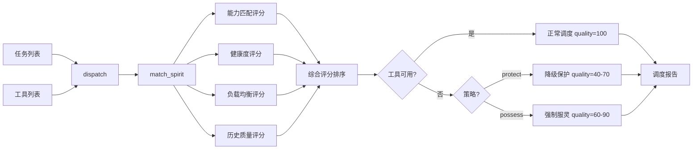

---
metadata:
  name: "juling-qianjiang"
  version: "v0.1.0"
  author: "under-one"
  description: "拘灵遣将 - 灵体统御中枢 - 主副灵编组、权限控制、反叛风险与阵型调度"
  language: "zh"
  tags: ['dispatch', 'agent-governance', 'rebellion-risk', 'formation', 'soul-binding', 'load-balancing']
  icon: "🐺"
  color: "#a5d6ff"
---

# 🐺 拘灵遣将 (Juling-Qianjiang)

> **灵体统御中枢 - 主副灵编组、权限控制、反叛风险与阵型调度**

## 目录

- [触发词](#触发词)
- [功能概述](#功能概述)
- [架构设计](#架构设计)
- [工作流程](#工作流程)
- [输入输出](#输入输出)
- [核心指标](#核心指标)
- [API接口](#api接口)
- [使用示例](#使用示例)
- [配置说明](#配置说明)
- [错误处理](#错误处理)
- [测试方法](#测试方法)
- [依赖环境](#依赖环境)
- [更新日志](#更新日志)

## 触发词

- 工具调度
- 多工具协调
- 子代理统御
- 灵体编组
- 反叛风险
- 降级保护
- 服灵模式
- 百鬼夜行
- 工具编排
- 灵体匹配
- 质量降级
- 故障转移
- 工具健康监控

## 功能概述

拘灵遣将的核心不只是“派工具”，而是把外部工具、灵体人格、子代理载体统一纳入统御链。V9.8 在原有调度之上继续增强恢复计划、升级契约和执行检查点，让“谁来做、怎么做、做过界会不会失控、失控后怎么收场”都被显式表达。

### 多维度评分匹配

为每个任务匹配最适合的工具，综合评估四个维度：

| 维度 | 权重 | 说明 |
|------|------|------|
| 能力匹配 (capability) | 40% | 精确匹配=1.0 / 别名匹配=0.8 |
| 健康度 (health) | 25% | 成功率×0.5 + 延迟×0.3 + 错误率×0.2 |
| 负载均衡 (load_balance) | 20% | 支持轮询/最少使用/最优评分策略 |
| 历史质量 (quality) | 15% | 工具历史质量得分 |

### 统御附加语义

| 能力 | 说明 |
|------|------|
| 指挥包 | 为每个任务生成 commander / primary / support / authority_mode |
| 边界识别 | 读取 soul.md 限制项并判断是否触犯灵体禁忌 |
| 反叛风险 | 输出 low / medium / high 风险与原因 |
| 阵型压制 | 根据阵型决定主副灵关系与指挥噪音容忍度 |

### 降级策略矩阵

| 策略 | 说明 | 质量保持 |
|------|------|----------|
| 降级保护 (protect) | 跳过/模拟/缓存 | 40-70% |
| 强制服灵 (possess) | 内化生成替代实现 | 60-90% |

### 降级策略矩阵

| 能力类型 | protect方法 | possess方法 | protect质量 | possess质量 |
|----------|-------------|-------------|-------------|-------------|
| search | cached_search | local_knowledge_search | 70% | 85% |
| browse | mock_fetch | cached_fetch | 50% | 80% |
| code | local_fallback | local_execution | 60% | 90% |
| data | stale_data | mock_response | 40% | 75% |
| 其他 | skip | mock_xxx | 0% | 60% |

## 架构设计

### 系统架构



### 文件结构

```
juling-qianjiang/
├── SKILL.md              # 本文件
└── scripts/
    └── dispatcher.py     # V9调度器
```

## 工作流程

1. **解析输入**：读取任务列表 + 工具列表/`soul.md`/`souls/` 目录 + 策略
2. **灵体匹配**：多维度评分匹配（能力/健康/负载/质量）
3. **灵魂解析**：若输入为 `soul.md`，提取能力、人格特征、限制条件、调用规则和 agent 家族
4. **阵型选择**：根据配置或命令行参数启用 `single-possession` / `dual-attunement` / `night-parade`
5. **阵型语义展开**：生成主附体独占、主副灵分工、夜行队列等不同协同计划
6. **能力别名扩展**：支持别名映射（如 `browse` → `fetch, crawl, scrape`）
7. **统御封包**：生成 command_plan，写明主灵、副灵、权限模式、调用规则
8. **边界检查**：检查任务目标是否触犯 soul.md 限制项
9. **反叛评估**：计算 rebellion_risk 并输出警报
10. **可用性检查**：检查工具是否可用
11. **降级处理**：不可用时根据策略执行protect或possess
12. **质量计算**：protect/possess质量系数 × 100，并吸收历史质量信号
13. **负载记录**：记录调用次数用于均衡
14. **指标记录**：写入runtime_data/juling-qianjiang_metrics.jsonl
15. **报告生成**：输出调度计划、降级日志、平均质量、匹配详情、`soul_bindings`、`command_plan`、`rebellion_alerts`

## 输入输出

- 输入清单：`tasks.json`、`spirits.json`、`soul.md`、`souls/`
- 输出清单：`dispatch_report_v9.json`

### 输入

任务列表 + 工具列表/灵体载体 + 策略：

```bash
python scripts/dispatcher.py tasks.json spirits.json [protect|possess]
python scripts/dispatcher.py tasks.json soul.md [protect|possess]
python scripts/dispatcher.py tasks.json souls/ [protect|possess]
python scripts/dispatcher.py tasks.json souls/ protect night-parade
```

任务列表示例 (`tasks.json`)：
```json
[
  {"type": "search", "query": "Python asyncio最佳实践"},
  {"type": "code", "task": "实现一个缓存装饰器"}
]
```

工具列表示例 (`spirits.json`)：
```json
[
  {"id": "google_search", "capabilities": ["search"], "available": true},
  {"id": "code_executor", "capabilities": ["code"], "available": false}
]
```

灵体载体示例 (`soul.md`)：
```md
# Hermes Agent Soul

## Persona
- calm
- analytical

## Capabilities
- research
- code
- writing
```

多灵体目录示例 (`souls/`)：
```text
souls/
├── openclaw/soul.md
└── hermes-agent/soul.md
```

### 输出

输出文件：`dispatch_report_v9.json`

输出文件为 `dispatch_report_v9.json`，并追加 metrics 记录：

```json
{
  "plan": [
    {
      "task": {"type": "search", "query": "..."},
      "status": "dispatched",
      "assigned": "google_search",
      "quality": 100
    },
    {
      "task": {"type": "code", "task": "..."},
      "status": "fallback_protect",
      "assigned": "code_executor",
      "method": "local_fallback",
      "quality": 60
    }
  ],
  "fallback_log": [
    {
      "spirit_id": "code_executor",
      "action": "fallback_protect",
      "method": "local_fallback",
      "quality_factor": 0.6,
      "note": "工具不可用，已降级保护"
    }
  ],
  "fallback_count": 1,
  "avg_quality": 80.0,
  "strategy": "protect",
  "formation": "night-parade",
  "all_success": false,
  "match_details": [
    {
      "task_type": "search",
      "spirit_id": "google_search",
      "match_score": 0.975,
      "match_detail": {"capability": 1.0, "health": 0.96, "load_balance": 1.0, "quality": 0.9}
    }
  ],
  "soul_bindings": [
    {
      "task_type": "code",
      "spirit_id": "hermes-agent",
      "agent_family": "hermes-agent",
      "source_path": "agents/hermes-agent/soul.md",
      "mode": "non_destructive_attunement",
      "summary": "Persona and capability digest extracted from soul.md",
      "role": "primary",
      "formation": "night-parade",
      "formation_intent": "parallel pressure and layered support",
      "recommended_traits": ["calm", "analytical"],
      "activated_capabilities": ["code", "research"],
      "avoid_constraints": ["do not mutate memory directly"],
      "invocation_protocol": [
        "activate only for refactor tasks",
        "remain read-only unless explicitly possessed"
      ],
      "support_spirits": [
        {
          "spirit_id": "openclaw",
          "match_score": 0.942,
          "activated_capabilities": ["planning", "code"]
        }
      ],
      "coordination_plan": [
        "hermes-agent acts as marshal for the code objective",
        "Support spirits contribute specialized abilities without taking over the lead voice"
      ],
      "spirit_queue": ["hermes-agent", "openclaw"],
      "parallel_channels": 2
    }
  ],
  "load_balance_state": {"google_search": 1, "code_executor": 1}
}
```

## 核心指标

| 指标 | 说明 | 范围 |
|------|------|------|
| fallback_count | 降级次数 | 0+ |
| avg_quality | 平均质量 | 0-100% |
| all_success | 全部成功（无降级） | true/false |
| strategy | 使用的策略 | protect / possess |
| formation | 附体阵型 | `single-possession` / `dual-attunement` / `night-parade` |
| method | 降级方法 | 根据能力类型动态选择 |
| soul_bindings | 附体建议列表 | 非破坏式 `soul.md` 绑定结果 |
| formation_intent | 阵型意图 | 纯继承 / 主副分工 / 夜行压制 |
| coordination_plan | 协同计划 | 主副灵如何分工 |
| spirit_queue | 灵体队列 | 灵体介入顺序 |
| role | 灵体角色 | `primary` 主附体 / 后续可扩展为其他角色 |
| support_spirits | 协同副灵 | 从剩余灵体中挑选的辅助 spirit |
| activated_capabilities | 激活能力 | 从 `soul.md` 中选择最适合当前任务的能力 |
| avoid_constraints | 避免触碰的限制 | 从 `soul.md` 的 limits / taboo 段提取 |
| invocation_protocol | 调用规约 | 从 `soul.md` 的 invocation rules 段提取 |

## API接口

| 接口 | 签名 | 说明 |
|------|------|------|
| 调度 | `dispatch(tasks, spirits, strategy="protect") -> dict` | 执行调度 |
| 调度 | `dispatch(tasks, spirits, strategy="protect", formation=None) -> dict` | 执行带阵型的调度 |
| 灵魂解析 | `parse_soul_markdown(text, source_path="soul.md") -> dict` | 将 `soul.md` 转成 spirit |
| 载体加载 | `load_spirits_source(path) -> list` | 从 JSON、单个 `soul.md` 或 `souls/` 目录加载 spirit |
| 灵体排序 | `rank_spirits(task, spirits, cfg=None) -> list` | 返回按综合得分排序的候选 spirit |
| 匹配 | `match_spirit(task, spirits, cfg=None) -> dict` | 多维度评分匹配 |
| 能力扩展 | `_expand_capabilities(task_type, aliases) -> set` | 支持别名扩展 |
| 能力评分 | `_score_capability_match(...) -> float` | 计算能力匹配得分 |
| 健康评分 | `_score_health(...) -> float` | 计算健康度得分 |
| 负载评分 | `_score_load_balance(...) -> float` | 计算负载均衡得分 |
| 质量评分 | `_score_quality(...) -> float` | 计算历史质量得分 |
| 降级保护 | `fallback_protect(spirit, cfg=None) -> dict` | 降级保护处理 |
| 强制服灵 | `fallback_possess(spirit, cfg=None) -> dict` | 内化替代实现 |

## 使用示例

### 命令行

```bash
# 默认降级保护模式
python scripts/dispatcher.py tasks.json spirits.json protect

# 强制服灵模式
python scripts/dispatcher.py tasks.json spirits.json possess

# 输出文件
# → dispatch_report_v9.json
# → runtime_data/juling-qianjiang_metrics.jsonl
```

### Python API

```python
from scripts.dispatcher import dispatch, match_spirit

# 定义任务和工具
tasks = [
    {"type": "search", "query": "Python asyncio"},
    {"type": "code", "task": "缓存装饰器"}
]

spirits = [
    {"id": "search_tool", "capabilities": ["search"], "available": True},
    {"id": "code_tool", "capabilities": ["code"], "available": False}
]

# 执行调度（降级保护模式）
result = dispatch(tasks, spirits, strategy="protect")

print(f"调度任务: {len(tasks)} 项")
print(f"降级次数: {result['fallback_count']}")
print(f"平均质量: {result['avg_quality']}%")

# 查看调度详情
for p in result["plan"]:
    status_emoji = "✅" if p["status"] == "dispatched" else "⚠️"
    print(f"{status_emoji} {p['task']['type']} -> {p.get('assigned', 'N/A')} (质量:{p['quality']}%)")

# 查看降级记录
for log in result["fallback_log"]:
    print(f"  降级: {log['spirit_id']} → {log['method']} ({log['note']})")
```

## 配置说明

引擎支持从 `under-one.yaml` 配置文件加载全部参数。

### 配置示例

```yaml
julingqianjiang:
  # 匹配评分权重
  match_weights:
    capability: 0.40
    health: 0.25
    load_balance: 0.20
    quality: 0.15
  
  # 负载均衡策略: round_robin | least_used | best_score
  load_balance_strategy: "best_score"
  
  # 健康度阈值
  health_warning: 0.60
  health_critical: 0.30
  
  # 能力别名映射（支持扩展匹配）
  capability_aliases:
    search:
      - "web_search"
      - "local_search"
      - "semantic_search"
    browse:
      - "fetch"
      - "crawl"
      - "scrape"
    code:
      - "execute"
      - "compile"
      - "lint"
    data:
      - "query"
      - "analyze"
      - "transform"
    write:
      - "generate"
      - "draft"
      - "edit"
  
  # 降级策略矩阵（protect模式）
  fallback_protect:
    search:
      method: "cached_search"
      quality: 0.70
    browse:
      method: "mock_fetch"
      quality: 0.50
    code:
      method: "local_fallback"
      quality: 0.60
    data:
      method: "stale_data"
      quality: 0.40
    write:
      method: "template_output"
      quality: 0.55
    default:
      method: "skip"
      quality: 0.0
  
  # 降级策略矩阵（possess模式）
  fallback_possess:
    search:
      method: "local_knowledge_search"
      quality: 0.85
    browse:
      method: "cached_fetch"
      quality: 0.80
    code:
      method: "local_execution"
      quality: 0.90
    data:
      method: "mock_response"
      quality: 0.75
    write:
      method: "llm_generation"
      quality: 0.80
    default:
      method: "mock_general"
      quality: 0.60
```

### 工具字段扩展

V9.1 支持以下可选字段用于更精确的匹配：

| 字段 | 类型 | 说明 |
|------|------|------|
| `capabilities` | list[str] | 能力列表 |
| `available` | bool | 是否可用 |
| `success_rate` | float | 历史成功率 (0-1) |
| `avg_latency_ms` | int | 平均响应延迟 (毫秒) |
| `error_rate` | float | 错误率 (0-1) |
| `quality_score` | float | 历史质量得分 (0-1) |

## 检查点设计

关键决策前需要用户确认：

| 检查点 | 触发条件 | 确认内容 | 默认行为 |
|--------|----------|----------|----------|
| 策略切换 | 工具不可用，考虑protect→possess | "工具 '{tool}' 不可用，是否切换至possess模式(质量更高但耗时更长)？" | protect |
| 质量降级确认 | 降级后质量 < 50% | "降级后预计质量仅{quality}%，是否仍执行？" | 是 |
| 批量调度 | 任务数 > 10 | "共{count}个任务待调度，是否全部执行？" | 是 |

## 错误处理

| 场景 | 处理方式 |
|------|----------|
| 参数不足 | CLI显示用法说明并exit 1 |
| 无匹配工具 | status="no_match", quality=0 |
| 无工具列表 | 第一个工具作为默认匹配 |
| JSON解析失败 | 抛出标准json.JSONDecodeError |

## 测试方法

```bash
# 运行相关测试
python -m pytest underone/tests/test_skills_core.py -v -k "juling_qianjiang"

# 快速手动测试
python scripts/dispatcher.py <(echo '[{"type":"search"}]') <(echo '[{"id":"s","capabilities":["search"],"available":true}]')
```

## 依赖环境

- Python 3.8+
- 无外部依赖（纯标准库：json, sys, random, pathlib, datetime）

## 更新日志

| 版本 | 日期 | 变更 |
|------|------|------|
| 9.8 | 当前 | **恢复契约增强**：新增 recovery_plan、escalation_contract、execution_checkpoints、governance_summary，提升多灵体执行可恢复性 |
| 9.1 | 历史 | 多维度评分匹配（能力/健康/负载/质量）；支持能力别名扩展匹配；负载均衡策略；配置化降级策略矩阵 |
| 9.0 | 历史 | V9发布，protect/possess双策略，metrics记录 |

---

*Generated for under-one.skills framework*
