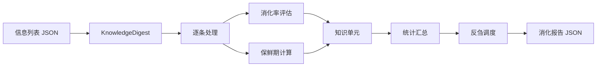

---
metadata:
  name: "liuku-xianzei"
  version: "v0.1.0"
  author: "under-one"
  description: "六库仙贼 - 知识消化器 - 信息保鲜、质量评估与反刍调度"
  language: "zh"
  tags: ['knowledge', 'digest', 'freshness', 'information-quality', 'review-schedule', 'credibility']
  icon: "🍃"
  color: "#ffdcd7"
---

# 🍃 六库仙贼 (LiuKu-XianZei)

> **知识消化器 - 信息保鲜、质量评估与反刍调度**
>
> **V5.4** — 配置化重构 · 梯度评分 · 信息密度因子 · 污染风险分层

## 目录

- [触发词](#触发词)
- [功能概述](#功能概述)
- [架构设计](#架构设计)
- [工作流程](#工作流程)
- [输入输出](#输入输出)
- [核心指标](#核心指标)
- [API接口](#api接口)
- [使用示例](#使用示例)
- [配置说明](#配置说明)
- [错误处理](#错误处理)
- [测试方法](#测试方法)
- [依赖环境](#依赖环境)
- [更新日志](#更新日志)

## 触发词

- 知识消化
- 信息保鲜
- 消化率评估
- 知识质量
- 反刍调度
- 信息可信度
- 知识单元
- 保鲜期计算
- 复习计划
- 信息分级

## 功能概述

评估信息消化率，生成结构化知识单元，计算保鲜期，输出反刍（复习）调度计划。核心能力：

| 能力 | 说明 | 版本 |
|------|------|------|
| 消化率评估 | 三要素梯度评分：核心论点 + 证据支撑 + 应用场景 | V5.3 |
| 短文本适配 | <50字符时自动降低检测阈值并给予密度补偿 | V5.2 |
| 可信度加权 | S:1.5 / A:1.2 / B:1.0 / C:0.6 | V5.0 |
| 保鲜期计算 | 按类别自动分配（法规7天~理论3年） | V5.0 |
| 反刍调度 | 配置化策略矩阵：低→4小时，中→1天，高→7天 | V5.3 |
| 信息密度因子 | 短文本补偿 / 最优长度奖励 / 超长惩罚 | V5.3 |
| 配置化参数 | 全部阈值、权重、关键词、规则外置至 under-one.yaml | V5.3 |
| 污染风险分层 | 按可信度/消化率/信号完整度评估污染风险 | V5.4 |
| 继承/隔离队列 | 自动区分可写入长期记忆与待复核知识单元 | V5.4 |

### 保鲜期规则

| 类别 | 保鲜期 |
|------|--------|
| 法律法规 | 7天 |
| 技术方案 | 90天 |
| 行业数据 | 180天 |
| 社区经验 | 90天 |
| 基础理论 | 1095天（3年） |
| 默认 | 180天 |

## 架构设计

### 系统架构



### 文件结构

```
liuku-xianzei/
├── SKILL.md              # 本文件
└── scripts/
    └── knowledge_digest.py   # 知识消化器
```

### 消化率评估模型 (V5.3)

```
┌─────────────────────────────────────────────────────────────┐
│  核心论点维度          证据支撑维度          应用场景维度    │
│  ├─ 匹配关键词计数     ├─ 匹配关键词计数     ├─ 匹配关键词计数│
│  ├─ 梯度评分 0~40      ├─ 梯度评分 0~30      ├─ 梯度评分 0~30│
│  └─ 短文本扩展关键词   └─ 短文本默认基础分   └─ 短文本默认基础分│
│                          ↓                                   │
│                    三要素分数直接相加 = 原始消化率 0~100      │
│                          ↓                                   │
│                    × 信息密度因子（补偿/奖励/惩罚）            │
│                          ↓                                   │
│                    × 可信度权重（S/A/B/C）                    │
│                          ↓                                   │
│                    有效消化率 = min(100, ...)                │
└─────────────────────────────────────────────────────────────┘
```

**梯度评分公式**：
- `score = full_score × min(1.0, match_count / max_expected)`
- 匹配越多得分越高，线性增长，上限满分
- `max_expected` 可在配置中调整（默认：核心论点=5，证据=4，应用=4）

## 工作流程

1. **解析输入**：读取JSON信息列表
2. **加载配置**：从 `under-one.yaml` 读取 `liukuxianzei` 配置段
3. **逐条处理**：对每条信息执行消化评估
4. **三要素检测**（梯度评分）：
   - 核心论点：匹配关键词计数 → 梯度评分 0~40
   - 证据支撑：匹配关键词计数 → 梯度评分 0~30
   - 应用场景：匹配关键词计数 → 梯度评分 0~30
5. **短文本适配**：<50字符时合并短文本专用关键词，evidence/app 给予基础分
6. **信息密度因子**：短文本补偿(×1.05) / 最优长度奖励(×1.10) / 超长惩罚(×0.95)
7. **可信度加权**：按 S/A/B/C 等级加权
8. **保鲜期计算**：根据category匹配保鲜规则
9. **反刍调度**：按配置化策略矩阵匹配消化率区间 → 生成复习计划
10. **报告生成**：输出统计分布、复习计划、质量标签

## 输入输出

### 输入

输入文件通常为 `info.json`，内容是 JSON 信息列表，每条包含来源、内容、可信度、类别：

```json
[
  {
    "source": "技术博客",
    "content": "Python 3.12引入了改进的错误消息和性能优化，推荐使用",
    "credibility": "A",
    "category": "技术方案"
  },
  {
    "source": "官方文档",
    "content": "asyncio库支持并发编程",
    "credibility": "S",
    "category": "基础理论"
  }
]
```

### 输出

输出文件为 `digest_report.json`，格式如下：

```json
{
  "digester": "liuku-xianzei",
  "version": "v0.1.0",
  "input_count": 5,
  "avg_digestion_rate": 63.6,
  "distribution": {"高": 2, "中": 1, "低": 2},
  "knowledge_units": [
    {
      "concept": "Python 3.12引入了改进的错误消息...",
      "source": "技术博客",
      "credibility": "A",
      "digestion_rate": 72.6,
      "digestion_level": "中",
      "category": "技术方案",
      "freshness_days": 90,
      "expires": "2026-08-05",
      "key_claim_matches": 3,
      "evidence_matches": 1,
      "application_matches": 1,
      "is_short_text": true,
      "density_multiplier": 1.05
    }
  ],
  "review_schedule": [
    {"concept": "Python 3.12...", "review_in": "1天", "reason": "待补充理解", "level": "中"}
  ],
  "inheritance_queue": [
    {"concept": "Python 3.12...", "source": "技术博客", "digestion_rate": 88.0, "contamination_risk": 0.22}
  ],
  "quarantine_queue": [
    {"concept": "试试这个", "source": "社区讨论", "digestion_rate": 31.5, "contamination_risk": 0.74}
  ],
  "contamination_risk": {"score": 0.41, "level": "medium"},
  "recommendation": "对低消化单元进行二次炼化",
  "quality_tags": ["需二次炼化", "含短文本", "需污染复核"]
}
```

## 核心指标

| 指标 | 说明 | 范围 | 版本 |
|------|------|------|------|
| digestion_rate | 有效消化率 | 0-100% | V5.0 |
| digestion_level | 消化等级 | 高(>80) / 中(>50) / 低 | V5.0 |
| freshness_days | 保鲜期 | 7-1095天 | V5.0 |
| credibility_weight | 可信度权重 | S:1.5, A:1.2, B:1.0, C:0.6 | V5.0 |
| key_claim_matches | 核心论点关键词匹配数 | 0-N | V5.3 |
| evidence_matches | 证据支撑关键词匹配数 | 0-N | V5.3 |
| application_matches | 应用场景关键词匹配数 | 0-N | V5.3 |
| is_short_text | 是否为短文本 | true/false | V5.3 |
| density_multiplier | 信息密度因子 | 0.95-1.10 | V5.3 |
| quality_tags | 质量标签列表 | 字符串数组 | V5.3 |
| contamination_risk | 整体污染风险分层 | low/medium/high | V5.4 |
| inheritance_queue | 可继承知识队列 | 数组 | V5.4 |
| quarantine_queue | 待复核知识队列 | 数组 | V5.4 |
| avg_digestion_rate | 平均消化率 | 加权平均 | V5.0 |
| distribution | 消化分布 | 高/中/低计数 | V5.0 |

## API接口

| 接口 | 签名 | 说明 | 版本 |
|------|------|------|------|
| 构造器 | `KnowledgeDigest(items: list)` | 传入信息列表，自动加载配置 | V5.3 |
| 消化 | `.digest() -> dict` | 执行知识消化，返回完整报告 | V5.0 |
| 单条处理 | `._process(item: dict) -> dict` | 处理单个信息项 | V5.0 |
| 配置加载 | `._load_config()` | 从 under-one.yaml 读取配置 | V5.3 |
| 梯度评分 | `._gradient_score(n, max_exp, full) -> float` | 按匹配比例计算分数 | V5.3 |
| 密度因子 | `._density_multiplier(length) -> float` | 计算信息密度补偿 | V5.3 |
| 反刍计划 | `._review_plan(level, rate, concept) -> dict` | 按配置规则生成复习计划 | V5.3 |

## 使用示例

### 命令行

```bash
python scripts/knowledge_digest.py info.json

# 输出文件
# → digest_report.json
```

### Python API

```python
from scripts.knowledge_digest import KnowledgeDigest
import json

# 加载信息
with open("info.json", "r", encoding="utf-8") as f:
    items = json.load(f)

# 创建消化器
digester = KnowledgeDigest(items)

# 执行消化
result = digester.digest()

# 查看结果
print(f"输入条数: {result['input_count']}")
print(f"平均消化率: {result['avg_digestion_rate']}%")
print(f"分布: 高{result['distribution']['高']} 中{result['distribution']['中']} 低{result['distribution']['低']}")

# 查看知识单元
for u in result["knowledge_units"]:
    emoji = {"高": "🟢", "中": "🟡", "低": "🔴"}[u["digestion_level"]]
    print(f"{emoji} [{u['digestion_level']}] {u['concept'][:30]} | 来源:{u['source']} | 保鲜:{u['freshness_days']}天")

# 查看复习计划
if result["review_schedule"]:
    for r in result["review_schedule"]:
        print(f"• {r['concept'][:20]}... -> {r['review_in']} ({r['reason']})")
```

## 配置说明

V5.3 全面接入 `under-one.yaml` 配置体系。配置段为 `liukuxianzei`，所有参数支持热更新（重启脚本生效）。

### 配置项清单

| 配置键 | 类型 | 默认值 | 说明 |
|--------|------|--------|------|
| `element_weights.core_claim` | float | 0.40 | 核心论点维度权重 |
| `element_weights.evidence` | float | 0.30 | 证据支撑维度权重 |
| `element_weights.application` | float | 0.30 | 应用场景维度权重 |
| `digestion_thresholds.high` | int | 80 | 高消化率阈值 |
| `digestion_thresholds.medium` | int | 50 | 中消化率阈值 |
| `scoring_gradient.core_claim_max` | int | 5 | 核心论点满分期望匹配数 |
| `scoring_gradient.evidence_max` | int | 4 | 证据支撑满分期望匹配数 |
| `scoring_gradient.application_max` | int | 4 | 应用场景满分期望匹配数 |
| `density_factor.short_text_limit` | int | 50 | 短文本字数上限 |
| `density_factor.short_bonus` | float | 1.05 | 短文本密度补偿 |
| `density_factor.optimal_min` | int | 80 | 最优长度下限 |
| `density_factor.optimal_max` | int | 500 | 最优长度上限 |
| `density_factor.optimal_bonus` | float | 1.10 | 最优长度奖励 |
| `density_factor.long_penalty_threshold` | int | 1000 | 超长惩罚阈值 |
| `density_factor.long_penalty` | float | 0.95 | 超长密度惩罚 |
| `keywords.core_claim` | list | 20个 | 核心论点检测关键词 |
| `keywords.evidence` | list | 12个 | 证据支撑检测关键词 |
| `keywords.application` | list | 10个 | 应用场景检测关键词 |
| `keywords.short_text` | list | 10个 | 短文本扩展关键词 |
| `review_schedule` | list | 3条 | 反刍调度规则矩阵 |
| `credibility_weights` | dict | 4项 | 可信度加权映射 |
| `freshness_days` | dict | 6项 | 类别保鲜期映射 |

### 配置示例

```yaml
liukuxianzei:
  element_weights:
    core_claim: 0.40
    evidence: 0.30
    application: 0.30
  digestion_thresholds:
    high: 80
    medium: 50
  scoring_gradient:
    core_claim_max: 5
    evidence_max: 4
    application_max: 4
  density_factor:
    short_text_limit: 50
    short_bonus: 1.05
    optimal_min: 80
    optimal_max: 500
    optimal_bonus: 1.10
    long_penalty_threshold: 1000
    long_penalty: 0.95
  keywords:
    core_claim: ["是", "为", "指", "提出", "表明", ...]
    evidence: ["数据", "统计", "研究表明", ...]
    application: ["用于", "应用", "场景", ...]
    short_text: ["推荐", "版本", "使用", ...]
  review_schedule:
    - level: "低"
      min_rate: 0
      max_rate: 50
      time: "4小时"
      reason: "低消化率，需尽快复习"
    - level: "中"
      min_rate: 50
      max_rate: 80
      time: "1天"
      reason: "待补充理解"
    - level: "高"
      min_rate: 80
      max_rate: 100
      time: "7天"
      reason: "巩固记忆"
  credibility_weights:
    S: 1.5
    A: 1.2
    B: 1.0
    C: 0.6
  freshness_days:
    技术方案: 90
    行业数据: 180
    基础理论: 1095
    法律法规: 7
    社区经验: 90
    默认: 180
```

## 检查点设计

关键决策前需要用户确认：

| 检查点 | 触发条件 | 确认内容 | 默认行为 |
|--------|----------|----------|----------|
| 低消化标记 | 消化率 < 50% | "'{concept}' 消化率仅{rate}%，是否加入4小时反刍队列？" | 是 |
| 过期知识清理 | 保鲜期已过 | "{n} 条知识已过期，是否标记为需更新？" | 否 |
| 可信度降级 | 原始可信度为S但内容短 | "'{concept}' 可信度{S}但内容较短，是否降级？" | 否 |

## 错误处理

| 场景 | 处理方式 |
|------|----------|
| 无参数 | CLI显示用法说明并exit 1 |
| 空列表 | avg_digestion_rate=0, distribution全0 |
| JSON解析失败 | 抛出标准json.JSONDecodeError |
| 缺credibility | 默认使用 "B" |
| 缺category | 默认使用 "默认"（180天） |

## 测试方法

```bash
# 运行相关测试
python -m pytest underone/tests/test_skills_core.py -v -k "digestion_level_distribution"

# 快速手动测试
python underone/skills/liuku-xianzei/scripts/knowledge_digest.py <(echo '[{"source":"测试","content":"研究表明数据支持结论","credibility":"S","category":"技术方案"}]')

# V5.4 完整验证（5种典型场景）
cat > /tmp/test_liuku.json << 'EOF'
[
  {"source": "技术博客", "content": "Python 3.12引入了改进的错误消息和性能优化，推荐使用", "credibility": "A", "category": "技术方案"},
  {"source": "官方文档", "content": "asyncio库支持并发编程，通过事件循环实现异步IO，广泛应用于高并发网络服务场景", "credibility": "S", "category": "基础理论"},
  {"source": "社区讨论", "content": "试试这个", "credibility": "C", "category": "社区经验"},
  {"source": "研究报告", "content": "研究表明，数据表明通过实验验证，数据分析显示结论：新算法在测试中提升了30%性能，量化对比结果证明其优势", "credibility": "S", "category": "技术方案"},
  {"source": "法规公告", "content": "新法规将于下月生效", "credibility": "A", "category": "法律法规"}
]
EOF
python underone/skills/liuku-xianzei/scripts/knowledge_digest.py /tmp/test_liuku.json
```

## 依赖环境

- Python 3.8+
- 无外部依赖（纯标准库：json, sys, pathlib, datetime）

## 更新日志

| 版本 | 日期 | 变更 |
|------|------|------|
| 5.4 | 当前 | **污染风险分层**：增加 contamination_risk 总览与单元级风险；**继承/隔离队列**：自动输出 inheritance_queue 与 quarantine_queue，便于长期记忆治理 |
| 5.3 | 当前 | **配置化重构**：接入 under-one.yaml 配置体系；**梯度评分**：三要素从 boolean 改为按匹配关键词数量梯度计分；**信息密度因子**：短文本补偿(×1.05)/最优长度奖励(×1.10)/超长惩罚(×0.95)；**反刍调度配置化**：支持按消化率区间自定义复习策略；**质量标签**：输出 quality_tags 辅助决策 |
| 5.2 | - | 短文本智能适配（<50字符启用专用关键词，evidence/app 默认给予基础分） |
| 5.0 | - | V5发布，三要素消化模型（核心论点+证据支撑+应用场景） |

---

*Generated for under-one.skills framework*
