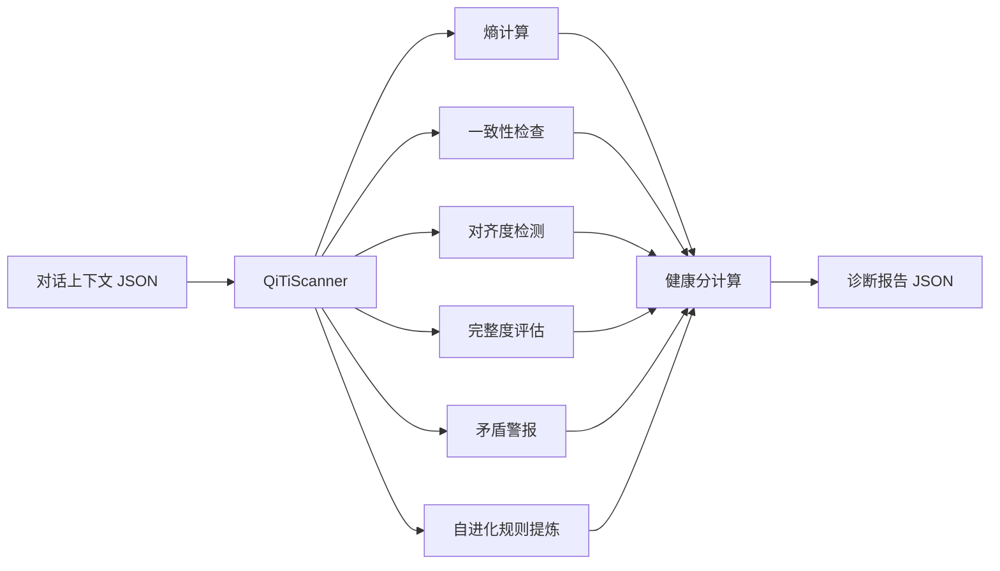

---
metadata:
  name: "qiti-yuanliu"
  version: "v0.1.0"
  author: "under-one"
  description: "炁体源流 - 本源自省器 - 自我反思、规则生长、稳态修复与目标锚定"
  language: "zh"
  tags: ['self-improvement', 'reflection', 'entropy', 'health-check', 'rule-growth', 'alignment']
  icon: "🔍"
  color: "#7ee787"
---

# 🔍 炁体源流 (QiTi-YuanLiu)

> **本源自省器 - 自我反思、规则生长、稳态修复与目标锚定**
>
> **V6.1** — 语义级熵计算 · 稳态修复契约 · 恢复门校验

## 目录

- [触发词](#触发词)
- [功能概述](#功能概述)
- [架构设计](#架构设计)
- [工作流程](#工作流程)
- [输入输出](#输入输出)
- [核心指标](#核心指标)
- [API接口](#api接口)
- [使用示例](#使用示例)
- [配置说明](#配置说明)
- [错误处理](#错误处理)
- [测试方法](#测试方法)
- [依赖环境](#依赖环境)
- [更新日志](#更新日志)

## 触发词

- 上下文健康检查
- 自我反思
- 规则生长
- 扫描对话状态
- 检测上下文漂移
- 计算上下文熵
- 对话质量评估
- 检查矛盾点
- 信息密度分析
- 目标对齐度检测
- 推理链完整性
- DNA快照生成

## 功能概述

扫描Agent对话上下文，计算多维健康指标（熵、一致性、对齐度、完整度、密度），并提炼可继承的自我规则、目标锚点与修正路径。核心能力包括：

| 能力 | 说明 | 版本 |
|------|------|------|
| 矛盾检测 | 语义级矛盾检测：关键词 + 否定反转 + 高否定密度 | V5.3 |
| 信息缺口 | 检测未闭合的疑问 | V5.0 |
| 冗余检测 | 语义相似度识别重复内容 | V5.3 |
| 目标漂移 | 语义关键词重叠度检测主题偏移 | V5.3 |
| 意图偏移 | 转折词密度检测意图变化 | V5.3 |
| DNA快照 | 生成最近N轮决策的哈希指纹 | V5.3 |
| 目标锚点 | 提炼首轮目标与用户约束 | V6.0 |
| 规则生长 | 生成可继承的自修正规则 | V6.0 |
| 自进化建议 | 给出下一轮炁循环的行动清单 | V6.0 |
| 稳态契约 | 生成冻结条件、修复计划与恢复门 | V6.1 |
| 配置化 | 全部参数外置至 under-one.yaml | V5.3 |

## 架构设计

### 系统架构



### 文件结构

```
qiti-yuanliu/
├── SKILL.md              # 本文件
└── scripts/
    └── entropy_scanner.py    # 核心扫描器
```

### 状态机

```
[INIT] → scan() → [ANALYZING] → 计算所有指标 → [REPORTING] → [DONE]
                                      ↓
                              检测到高熵 → [ALERT]
```

## 工作流程

1. **解析输入**：读取JSON格式的对话上下文
2. **加载配置**：从 `under-one.yaml` 读取 `qitiyuanliu` 配置段
3. **语义级熵计算**：
   - 矛盾检测：关键词 + 否定反转模式 + 高否定密度
   - 信息缺口：未闭合疑问检测
   - 冗余检测：语义相似度 > 0.7
   - 主题漂移：首轮目标语义关键词与后续轮次重叠度
   - 意图偏移：转折词密度检测
4. **一致性检查**：基于语义矛盾数量估算
5. **对齐度检测**：语义关键词重叠度 vs 首轮目标
6. **完整度评估**：检测逻辑标记词（因为/所以/首先/然后/因此/总之）
7. **信息密度**：实词比例（高>55% / 中>35% / 低）
8. **矛盾警报**：生成结构化语义警报列表
9. **健康分计算**：加权综合评分（一致性25% + 对齐度25% + 完整度20% + 熵 bonus 30%）
10. **报告生成**：输出JSON诊断报告 + 修复建议

## 输入输出

### 输入

输入文件通常为 `context.json`，内容是 JSON 格式的对话上下文，每轮包含角色、内容、轮次：

```json
[
  {"role": "user", "content": "请帮我分析竞品数据", "round": 1},
  {"role": "assistant", "content": "好的，我将从市场份额...", "round": 2},
  {"role": "user", "content": "不对，我说的是用户数据不是市场", "round": 3}
]
```

### 输出

输出文件模式为 `*.health_report.json`，典型文件如 `context.health_report.json`。JSON诊断报告格式如下：

```json
{
  "scanner": "qiti-yuanliu",
  "version": "v0.1.0",
  "context_length": 3,
  "metrics": {
    "entropy": 2.0,
    "entropy_level": "green",
    "consistency": 85,
    "alignment": 95,
    "completeness": 60,
    "density": "high",
    "health_score": 82.5,
    "health_level": "good"
  },
  "alerts": [
    {
      "level": "warning",
      "type": "contradiction",
      "round": 3,
      "message": "检测到矛盾关键词 '不对'"
    }
  ],
  "recommendations": [
    "已生成 repair_handoff，建议调用dalu-dongguan执行跨段追踪与锚点重建",
    "上下文状态健康，继续正常运行"
  ],
  "repair_handoff": {
    "triggered": true,
    "target_skill": "dalu-dongguan",
    "action": "cross_segment_trace",
    "reason": "repeated_contradictions",
    "alert_threshold": 2,
    "observed_alerts": 3,
    "contradiction_rounds": [3],
    "summary": "检测到 3 条矛盾警报，建议切换至dalu-dongguan执行跨段追踪与锚点修复",
    "evidence": [
      {"round": 3, "type": "keyword", "keyword": "不对", "preview": "不对，我说的是用户数据不是市场..."}
    ]
  },
  "dna_snapshot": {
    "hash": "a3f7b2",
    "based_on": "last_3_rounds",
    "timestamp": "auto"
  }
}
```

## 核心指标

| 指标 | 说明 | 计算方式 | 阈值/范围 | 版本 |
|------|------|----------|-----------|------|
| entropy | 上下文熵 | 语义级加权：矛盾×2 + 缺口×1.5 + 冗余×0.5 + 漂移×1.8 + 偏移×1.2 | warning: 3.0, critical: 7.0 | V5.3 |
| entropy_components | 熵组件详情 | {conflict, gap, redundancy, topic_drift, intent_shift} | 结构化 | V5.3 |
| consistency | 一致性 | 100 - 语义矛盾数×15 | min: 60% | V5.3 |
| alignment | 目标对齐度 | 语义关键词重叠度与首轮对比 | 0-100% | V5.3 |
| completeness | 推理链完整度 | base + 逻辑标记×per_marker | 0-100% | V5.3 |
| density | 信息密度 | 实词比例：高>55% / 中>35% / 低 | high/medium/low | V5.3 |
| content_word_ratio | 实词比例 | 实词数 / 总词数 | 0-1.0 | V5.3 |
| health_score | 综合健康分 | 加权评分 | excellent: 90+, good: 75+ | V5.0 |
| health_level | 健康等级 | 基于阈值映射 | danger/warning/good/excellent | V5.0 |
| repair_handoff | 自动修复交接单 | 重复矛盾达到阈值时生成结构化移交信息 | `null` 或 object | V5.3 |

## API接口

| 接口 | 签名 | 说明 | 版本 |
|------|------|------|------|
| 构造器 | `QiTiScanner(context_data: list)` | 传入对话上下文列表，自动加载配置 | V5.3 |
| 全量扫描 | `.scan() -> dict` | 执行完整语义级扫描，返回诊断报告 | V5.3 |
| 配置加载 | `._load_config()` | 从 under-one.yaml 读取配置 | V5.3 |
| 熵计算 | `._calc_entropy()` | 语义级熵计算（含组件详情） | V5.3 |
| 一致性 | `._check_consistency()` | 基于语义矛盾数估算一致性 | V5.3 |
| 对齐度 | `._check_alignment()` | 语义关键词重叠度检测漂移 | V5.3 |
| 完整度 | `._check_completeness()` | 检测逻辑链完整性 | V5.3 |
| 矛盾检测 | `._detect_all_contradictions() -> list` | 语义矛盾检测（关键词+反转+密度） | V5.3 |
| 主题漂移 | `._calc_topic_drift() -> float` | 语义相似度检测主题偏移 | V5.3 |
| 意图偏移 | `._calc_intent_shift() -> float` | 转折词密度检测意图变化 | V5.3 |
| 信息密度 | `._calc_semantic_density() -> str` | 实词比例计算密度等级 | V5.3 |
| 健康分 | `._calc_health_score()` | 加权计算综合健康分 | V5.3 |
| 报告 | `._generate_report() -> dict` | 生成完整JSON报告 | V5.3 |

## 使用示例

### 命令行

```bash
# 基本用法
python scripts/entropy_scanner.py context.json

# 输出文件
# → context.health_report.json
```

### Python API

```python
from scripts.entropy_scanner import QiTiScanner
import json

# 加载对话上下文
with open("context.json", "r", encoding="utf-8") as f:
    context = json.load(f)

# 创建扫描器并执行扫描
scanner = QiTiScanner(context)
report = scanner.scan()

# 获取关键指标
print(f"健康分: {report['metrics']['health_score']}")
print(f"熵等级: {report['metrics']['entropy_level']}")
print(f"警报数: {len(report['alerts'])}")

# 判断是否健康
if report["metrics"]["health_level"] in ("good", "excellent"):
    print("✅ 上下文状态健康")
else:
    print("⚠️ 建议执行修复:", report["recommendations"])
```

## 配置说明

V5.3 全面接入 `under-one.yaml` 配置体系。配置段为 `qitiyuanliu`。

### 配置项清单

| 配置键 | 类型 | 默认值 | 说明 |
|--------|------|--------|------|
| `entropy_weights.conflict` | float | 2.0 | 矛盾熵权重 |
| `entropy_weights.gap` | float | 1.5 | 缺口熵权重 |
| `entropy_weights.redundancy` | float | 0.5 | 冗余熵权重 |
| `entropy_weights.topic_drift` | float | 1.8 | 主题漂移熵权重 |
| `entropy_weights.intent_shift` | float | 1.2 | 意图偏移熵权重 |
| `entropy_thresholds.warning` | float | 3.0 | 熵警告阈值 |
| `entropy_thresholds.critical` | float | 7.0 | 熵危险阈值 |
| `contradiction.keywords` | list | 9项 | 直接矛盾关键词 |
| `contradiction.negation_prefixes` | list | 8项 | 否定前缀 |
| `contradiction.reversal_patterns` | list | 8对 | 语义反转模式 |
| `contradiction.clarification_markers` | list | 8项 | 用户澄清/口径修正标记 |
| `contradiction.hard_reset_markers` | list | 8项 | 强制推翻/重做标记 |
| `intent_shift.shift_density_threshold` | float | 2.0 | 转折词密度阈值（每百字） |
| `intent_shift.transition_words` | list | 8项 | 转折关键词 |
| `intent_shift.negation_density_threshold` | float | 3.0 | 否定密度阈值 |
| `semantic_density.high_threshold` | float | 0.55 | 高密度实词比例阈值 |
| `semantic_density.medium_threshold` | float | 0.35 | 中密度实词比例阈值 |
| `completeness.logic_markers` | list | 9项 | 逻辑标记词 |
| `completeness.base_score` | int | 50 | 完整度基础分 |
| `completeness.per_marker` | int | 5 | 每标记加分 |
| `completeness.max_score` | int | 100 | 完整度满分 |
| `health_weights.consistency` | float | 0.25 | 一致性权重 |
| `health_weights.alignment` | float | 0.25 | 对齐度权重 |
| `health_weights.completeness` | float | 0.20 | 完整度权重 |
| `health_weights.entropy_bonus` | float | 0.30 | 熵奖励权重 |
| `health_thresholds.excellent` | int | 90 | 优秀阈值 |
| `health_thresholds.good` | int | 75 | 良好阈值 |
| `health_thresholds.warning` | int | 60 | 警告阈值 |
| `alignment.first_goal_length` | int | 150 | 首轮目标参考长度 |
| `alignment.min_msg_length` | int | 30 | 后续消息最小长度 |
| `alignment.low_overlap_threshold` | float | 0.2 | 低重叠度阈值 |
| `alignment.drift_penalty` | int | 8 | 每轮漂移扣分 |
| `repair_handoff.contradiction_threshold` | int | 2 | 触发交接所需最少矛盾警报数 |
| `repair_handoff.target_skill` | string | dalu-dongguan | 默认交接目标 skill |
| `repair_handoff.action` | string | cross_segment_trace | 建议下游执行动作 |
| `repair_handoff.reason` | string | repeated_contradictions | 交接原因标签 |
| `repair_handoff.evidence_limit` | int | 3 | 输出的矛盾证据条数上限 |
| `dna_snapshot.rounds` | int | 3 | DNA快照轮数 |
| `dna_snapshot.preview_length` | int | 30 | 每轮预览长度 |

详见 [`_skill_config.py`](../../_skill_config.py) 配置加载器。

## 检查点设计

关键决策前需要用户确认：

| 检查点 | 触发条件 | 确认内容 | 默认行为 |
|--------|----------|----------|----------|
| 高熵修复 | entropy >= 7.0 (critical) | "上下文熵过高({entropy})，建议立即执行稳态修复，是否执行？" | 否 |
| 矛盾警报 | 检测到矛盾关键词 | "第{round}轮检测到矛盾'{keyword}'，是否调用大罗洞观追踪？" | 是 |
| 目标漂移 | alignment < 60% | "目标对齐度仅{alignment}%，可能已漂移，是否重新锚定？" | 是 |

## 错误处理

| 场景 | 处理方式 |
|------|----------|
| 空上下文 | health_score = 100, alignment = 100 |
| 文件不存在 | CLI返回exit 1，提示错误 |
| JSON解析失败 | 抛出标准json.JSONDecodeError |
| 配置加载失败 | 自动回退到硬编码默认值 |

## 测试方法

```bash
# 运行相关测试
python -m pytest underone/tests/test_skills_core.py -v -k "qiti_yuanliu"

# 快速手动测试
python underone/skills/qiti-yuanliu/scripts/entropy_scanner.py <(echo '[{"role":"user","content":"test","round":1}]')

# V5.3 语义级验证（含矛盾/漂移/偏移场景）
cat > /tmp/test_qiti.json << 'EOF'
[
  {"role": "user", "content": "请帮我分析竞品数据，重点关注市场份额和用户增长趋势", "round": 1},
  {"role": "assistant", "content": "好的，我将从市场份额、用户增长、营收模式三个维度进行竞品分析。首先看市场份额...", "round": 2},
  {"role": "user", "content": "不对，我说的是用户数据不是市场，你搞错了方向", "round": 3},
  {"role": "assistant", "content": "抱歉，我重新聚焦用户数据。从用户增长趋势来看...", "round": 4},
  {"role": "user", "content": "但是用户增长的数据来源可靠吗？我觉得需要验证一下", "round": 5}
]
EOF
python underone/skills/qiti-yuanliu/scripts/entropy_scanner.py /tmp/test_qiti.json
```

## 依赖环境

- Python 3.8+
- 无外部依赖（纯标准库：json, sys, re, pathlib, collections）

## 更新日志

| 版本 | 日期 | 变更 |
|------|------|------|
| 5.3 | 当前 | **语义级熵计算**：新增主题漂移、意图偏移检测；**语义矛盾检测**：否定前缀+反转模式+高否定密度；**语义信息密度**：实词比例替代字数；**配置化重构**：全部参数迁移至 under-one.yaml；**增强DNA快照**：轮数和预览长度可配置 |
| 5.0 | - | V5发布，支持配置外部化（仅3个阈值） |

---

*Generated for under-one.skills framework*
