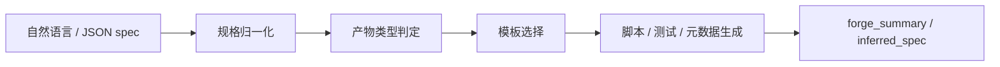

---
metadata:
  name: "shenji-bailian"
  version: "v0.1.0"
  author: "under-one"
  description: "神机百炼 - 自然语言技能工坊 - 根据自然语言或结构化规格生成 skill、tool、专精骨架与配套资产"
  language: "zh"
  tags: ['code-generation', 'skill-generation', 'tool-factory', 'scaffolding', 'contract', 'testing', 'structured-spec', 'natural-language']
  icon: "🔨"
  color: "#ffa657"
---

# 神机百炼 (ShenJi-BaiLian)

> 自然语言技能工坊 - 将一句需求锻造成 skill、tool、测试与契约。

## 触发词

- 生成工具
- 生成 skill
- 锻造 skill
- 生成 CLI
- 脚本工具
- 代码脚手架
- 自然语言生成工具

## 功能概述

`神机百炼` 现在不只是接 JSON 规格的工具工厂，而是一个更上层的锻造器：

1. 可以直接吃**自然语言描述**
2. 自动判断你要的是 **tool** 还是 **skill**
3. 生成对应的脚本、测试、契约，以及 `SKILL.md / _skillhub_meta.json`
4. 同时保留旧版结构化 spec 的兼容能力
5. 按专精生成不同骨架与配套资产



## 输入输出

### 输入

- `自然语言描述`
- `prompt.txt`
- `spec.json`
- `structured-spec.json`

### 输出

- `*.py`
- `*.md`
- `*_skillhub_meta.json`
- 以及按专精生成的配套资产

## 对齐式增强

V6.5 重点增强：

1. **自然语言输入**：支持一句话直接锻造
2. **双产物类型**：支持 `artifact_type = tool / skill`
3. **专精识别**：支持 `browser-skill / analysis-skill / workflow-skill / cli-tool / data-tool`
4. **结构化回推**：输出 `inferred_spec`
5. **专精资产**：自动附带示例输入、schema、workflow 模板等文件
6. **兼容旧版**：原有 spec、模式和工具三件套仍然保留
7. **检索专精增强**：retrieval-skill 默认支持 `documents / document_paths / source_text / source_urls / retriever_endpoint`
8. **共享源适配层**：browser-skill 与 analysis-skill 也会附带 `scripts/source_adapter.py`，统一本地路径、URL 与外部检索入口的加载逻辑

## 输入方式

### 1. 自然语言

```text
生成一个用于校验 JSON 输入并输出结果的 CLI 工具
```

```text
请生成一个用于检索和总结网页内容的 skill
```

### 2. 结构化规格

```json
{
  "artifact_type": "tool",
  "forge_mode": "battle-ready",
  "tool": {
    "name": "json_cleaner",
    "description": "清洗 JSON 文件，去除空值"
  },
  "io_contract": {
    "inputs": ["raw.json"],
    "outputs": ["clean.json"]
  }
}
```

## 产物类型

| 类型 | 说明 | 典型产出 |
|------|------|----------|
| `tool` | 单个脚本工具 | `*.py` / `test_*.py` / `*.contract.md` |
| `skill` | 可纳入 skills 体系的技能目录 | `SKILL.md` / `_skillhub_meta.json` / `scripts/*.py` |

## 锻造模式

| 模式 | 说明 |
|------|------|
| `scaffold-only` | 快速生成骨架 |
| `contract-first` | 强化契约与验证 |
| `battle-ready` | 默认完整锻造 |

## 工作流程

1. 读取自然语言或 JSON 规格
2. 归一化为内部锻造规格
3. 推断 `artifact_type`
4. 匹配模板并生成主脚本
5. 按模式生成测试、契约或 skill 元数据
6. 输出 `forge_summary` 与 `inferred_spec`

## 输出结构

V6.2 返回结果示例：

```json
{
  "factory": "shenji-bailian",
  "version": "v0.1.0",
  "tool_name": "retrieval_skill",
  "artifact_type": "skill",
  "forge_mode": "battle-ready",
  "forge_intent": "deployable forging",
  "inferred_spec": {
    "artifact_type": "skill"
  },
  "files": {
    "retrieval_skill/SKILL.md": "...",
    "retrieval_skill/_skillhub_meta.json": "...",
    "retrieval_skill/scripts/retrieval_skill.py": "..."
  }
}
```

专精型 skill 还会额外生成配套资产，例如：

- `assets/browser_targets.json`
- `assets/report_schema.json`
- `assets/workflow_template.json`

## API接口

| 接口 | 签名 | 说明 |
|------|------|------|
| CLI | `python scripts/tool_factory.py <prompt_or_spec>` | 根据自然语言或规格执行锻造 |
| Python | `ToolFactory(spec).forge() -> dict` | 返回产物类型、推断规格与生成文件 |

## 使用示例

### 命令行

```bash
python scripts/tool_factory.py "生成一个用于校验 JSON 输入的 CLI 工具"
python scripts/tool_factory.py "请生成一个用于检索网页内容的 skill"
python scripts/tool_factory.py spec.json
```

### Python API

```python
from scripts.tool_factory import ToolFactory

factory = ToolFactory("请生成一个用于检索和总结网页内容的 skill")
result = factory.forge()

print(result["artifact_type"])
print(result["inferred_spec"])
print(result["files"].keys())
```

## 测试方法

当前已覆盖：

- 旧版结构化 spec 兼容
- `scaffold-only` 减产出行为
- 自然语言生成 tool
- 自然语言生成 skill
- analysis/browser/workflow 专精识别
- 专精骨架字段生成
- 专精配套资产生成

建议回归命令：

```bash
pytest underone/tests/test_skills_core.py -q
pytest underone/tests/test_skills_core.py underone/tests/test_under_one.py
```

## 版本变更

### V6.4

- 支持专精目录资产生成
- 支持专精化 `SKILL.md` 说明
- 支持 browser / analysis / workflow 半成品运行框架

### V6.3

- 支持专精类型驱动不同脚本骨架

### V6.2

- 支持自然语言直出 tool / skill
- 支持 skill 目录与元数据生成
- 输出 `artifact_type` 与 `inferred_spec`

### V5.6

- 支持结构化规格输入
- 支持模式化锻造
- 输出锻造摘要
