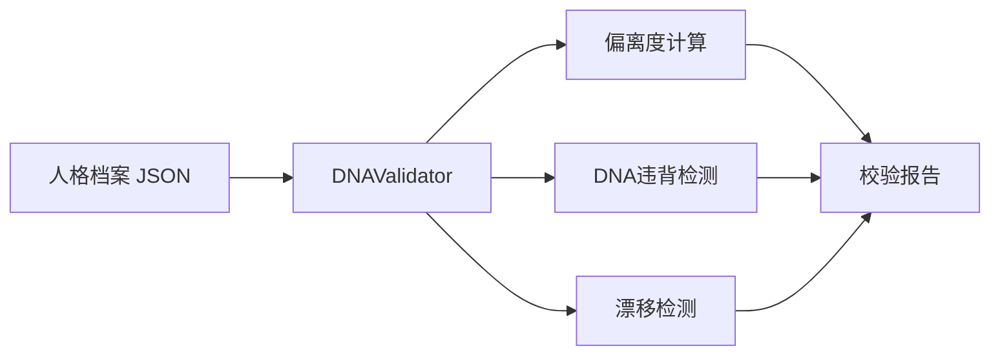

---
metadata:
  name: "shuangquanshou"
  version: "v0.1.0"
  author: "under-one"
  description: "双全手 - 记忆与人格手术台 - 记忆/人格/情绪/感知改写与污染控制"
  language: "zh"
  tags: ['persona', 'memory', 'rewrite', 'dna', 'emotion', 'perception']
  icon: "✋"
  color: "#aff5b4"
---

# ✋ 双全手 (ShuangQuanShou)

> **记忆与人格手术台 - 记忆/人格/情绪/感知改写与污染控制**

## 目录

- [触发词](#触发词)
- [功能概述](#功能概述)
- [架构设计](#架构设计)
- [工作流程](#工作流程)
- [输入输出](#输入输出)
- [核心指标](#核心指标)
- [API接口](#api接口)
- [使用示例](#使用示例)
- [配置说明](#配置说明)
- [错误处理](#错误处理)
- [测试方法](#测试方法)
- [依赖环境](#依赖环境)
- [更新日志](#更新日志)

## 触发词

- DNA校验
- 人格守护
- 记忆改写
- 情绪调谐
- 感知重塑
- 风格漂移
- 人设检查
- 风格切换验证
- 偏离度计算
- 人格分裂防护
- DNA违背检测
- 风格一致性
- 核心原则校验

## 功能概述

双全手不再只做校验，而是先判断能不能改，再给出怎么改。它会针对记忆、人格、情绪、感知四个域生成手术方案，并用 DNA 核心原则拦截危险改写。支持以下能力：

| 能力 | 说明 |
|------|------|
| 偏离度计算 | 对比当前风格与期望风格的差异 |
| DNA违背检测 | 检查请求是否违背核心原则 |
| 人格分裂防护 | 检测3轮内风格切换是否超过3次 |
| 手术方案生成 | 为记忆/人格/情绪/感知生成可执行 patch 预案 |
| 污染控制 | 计算污染指数与身份完整度 |

### 校验维度

| 维度 | 说明 |
|------|------|
| tone | 语气风格 |
| formality | 正式程度 |
| detail_level | 细节程度 |
| structure | 结构偏好 |

### 禁止领域

医疗、法律、投资、嘲讽、贬低、侮辱、欺骗、编造

## 架构设计

### 系统架构



### 文件结构

```
shuangquanshou/
├── SKILL.md              # 本文件
└── scripts/
    └── dna_validator.py  # DNA校验器
```

### 状态机

```
[INIT] → validate() → [CALC_DEVIATION] → [CHECK_VIOLATIONS] → [DETECT_DRIFT] → [DONE]
                                                              ↓
                                                    发现违背 → [ALERT]
```

## 工作流程

1. **偏离度计算**：对比 current_style 与 dna_expectation 的4个维度差异
2. **DNA违背检测**：检查 requested_change 是否触发 dna_core 中的禁止规则
3. **人格分裂防护**：检查 history 中最近3轮是否有≥3种不同风格
4. **手术域识别**：判断这是记忆、人格、情绪还是感知改写
5. **方案生成**：输出 before / after / status / risk
6. **污染评估**：计算 contamination_index 与 identity_integrity
7. **报告生成**：输出偏离度、手术模式、是否允许切换、修复建议

## 输入输出

### 输入

输入文件通常为 `profile.json`，内容是 JSON 人格档案，包含当前风格、期望风格、核心DNA、历史记录：

```json
{
  "current_style": {
    "tone": 3,
    "formality": 4,
    "detail_level": 3,
    "structure": 5
  },
  "dna_expectation": {
    "tone": 3,
    "formality": 4,
    "detail_level": 3,
    "structure": 5
  },
  "dna_core": {
    "诚信": "不编造",
    "安全": "不提供医疗法律投资建议",
    "尊重": "不嘲讽贬低"
  },
  "requested_change": {
    "type": "语气",
    "target": "嘲讽风格"
  },
  "history": [
    {"style": "formal", "round": 1},
    {"style": "casual", "round": 2},
    {"style": "technical", "round": 3}
  ]
}
```

### 输出

输出文件为 `dna_report.json`，格式如下：

```json
{
  "validator": "shuangquanshou",
  "version": "v0.1.0",
  "deviation_score": 0.15,
  "drift_level": "green",
  "dna_violations": [
    {
      "principle": "尊重",
      "rule": "不嘲讽贬低",
      "severity": "critical",
      "action": "拒绝切换，保持核心DNA"
    }
  ],
  "can_switch": false,
  "recommendations": [
    "检测到1项DNA违背，拒绝风格切换"
  ]
}
```

## 核心指标

| 指标 | 说明 | 范围/阈值 |
|------|------|-----------|
| deviation_score | 偏离度 | 0-1，基于4维度平均差异 |
| drift_level | 漂移等级 | green(<0.2) / yellow(<0.4) / red |
| can_switch | 允许切换 | true/false，需无违背且偏离<0.5 |
| dna_violations | DNA违背列表 | 含严重等级和修复动作 |
| severity | 违背严重程度 | critical / warning |

## API接口

| 接口 | 签名 | 说明 |
|------|------|------|
| 构造器 | `DNAValidator(profile: dict)` | 传入人格档案 |
| 校验 | `.validate() -> dict` | 执行完整DNA校验 |
| 偏离度 | `._calc_deviation()` | 计算风格偏离度 |
| DNA违背 | `._check_dna_violations()` | 检查核心原则违背 |
| 漂移检测 | `._detect_drift()` | 检测人格分裂倾向 |
| 禁止检查 | `._is_forbidden(text, rule) -> bool` | 关键词禁止匹配 |

## 使用示例

### 命令行

```bash
python scripts/dna_validator.py profile.json

# 输出文件
# → dna_report.json
```

### Python API

```python
from scripts.dna_validator import DNAValidator
import json

# 加载人格档案
with open("profile.json", "r", encoding="utf-8") as f:
    profile = json.load(f)

# 创建校验器
validator = DNAValidator(profile)

# 执行校验
result = validator.validate()

# 查看偏离度
print(f"偏离度: {result['deviation_score']:.3f} ({result['drift_level']})")
print(f"允许切换: {'✅ 是' if result['can_switch'] else '❌ 否'}")

# 查看违背
if result["dna_violations"]:
    for v in result["dna_violations"]:
        emoji = "🔴" if v["severity"] == "critical" else "🟡"
        print(f"{emoji} [{v['severity']}] {v['principle']}: {v['action']}")
else:
    print("✅ 无DNA违背")

# 查看建议
for r in result["recommendations"]:
    print(f"• {r}")
```

## 配置说明

V5.2 支持从 `under-one.yaml` 动态加载以下配置：

| 配置项 | 说明 | 默认值 |
|--------|------|--------|
| `forbidden_categories` | 禁止词语义类别映射 | 8类（医疗/法律/投资/嘲讽/贬低/侮辱/欺骗/编造） |
| `negation_prefixes` | 否定前缀列表 | 11个 |
| `style_dimensions` | 风格校验维度 | tone/formality/detail_level/structure |
| `drift_thresholds` | 漂移等级阈值 | green:0.2 / yellow:0.4 / red:0.5 |
| `split_detection` | 人格分裂检测参数 | rounds:3 / unique_styles:3 |

## 检查点设计

关键决策前需要用户确认：

| 检查点 | 触发条件 | 确认内容 | 默认行为 |
|--------|----------|----------|----------|
| DNA违背拦截 | 检测到critical违背 | "检测到'{principle}'违背(severity: critical)，是否拒绝请求？" | 是（拒绝） |
| 风格切换 | 偏离度 < 0.5 且无违背 | "偏离度{deviation}，允许切换风格，是否确认？" | 是 |
| 人格分裂预警 | 3轮内风格切换 >= 3次 | "检测到频繁风格切换，可能有人格分裂风险，是否锁定当前风格？" | 是 |

## 错误处理

| 场景 | 处理方式 |
|------|----------|
| 无参数 | CLI显示用法说明并exit 1 |
| 缺current_style | 偏离度=0 |
| 缺dna_expectation | 偏离度=0 |
| 缺history | 跳过人格分裂检测 |
| JSON解析失败 | 抛出标准json.JSONDecodeError |

## 测试方法

```bash
# 运行相关测试
python -m pytest underone/tests/test_skills_core.py -v -k "shuangquanshou"

# 快速手动测试
python scripts/dna_validator.py <(echo '{"current_style":{"tone":3},"dna_expectation":{"tone":3}}')
```

## 依赖环境

- Python 3.8+
- 无外部依赖（纯标准库：json, sys, pathlib）

## 更新日志

| 版本 | 日期 | 变更 |
|------|------|------|
| 5.2 | 当前 | 配置化重构：禁止词/否定前缀/风格维度/漂移阈值/人格分裂检测参数从 under-one.yaml 加载 |
| 5.1 | - | V5.1升级：语义级禁止检测，支持否定语义识别和同义词扩展 |
| 5.0 | - | V5发布，四维偏离度+DNA违背检测 |

---

*Generated for under-one.skills framework*
