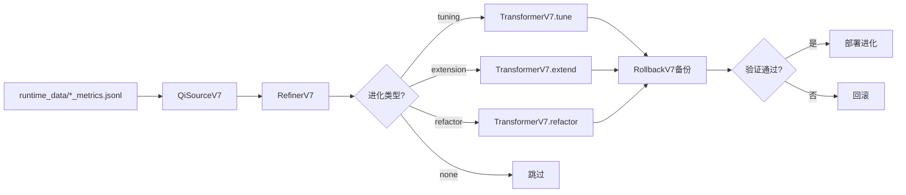

---
metadata:
  name: "xiushen-lu"
  version: "v0.1.0"
  author: "under-one"
  description: "修身炉 - 自进化中枢 - 默认只读分析、自适应阈值护栏与跨skill学习"
  language: "zh"
  tags: ['evolution', 'self-improvement', 'adaptive', 'threshold', 'learning', 'cross-skill', 'rollback']
  icon: "🔥"
  color: "#f778ba"
---

# 🔥 修身炉 (XiuShen-Lu)

> **自进化中枢 - 默认只读分析、自适应阈值护栏与跨skill学习**

## 目录

- [触发词](#触发词)
- [功能概述](#功能概述)
- [架构设计](#架构设计)
- [工作流程](#工作流程)
- [输入输出](#输入输出)
- [核心指标](#核心指标)
- [API接口](#api接口)
- [使用示例](#使用示例)
- [配置说明](#配置说明)
- [错误处理](#错误处理)
- [测试方法](#测试方法)
- [依赖环境](#依赖环境)
- [更新日志](#更新日志)

## 触发词

- 技能进化
- 自进化
- 阈值自适应
- 深度进化
- 跨技能学习
- 知识迁移
- 版本回滚
- 瓶颈分析
- 健康评分
- 进化周期

## 功能概述

Agent自进化中枢V7.1：自适应阈值引擎（根据历史数据动态调整）、深度进化（优化脚本内部参数）、跨skill学习（借鉴其他skill优化经验）、知识迁移（验证有效的阈值自动共享）。

**V7.1 护栏新增**：默认只读分析，`apply_changes=False` 时不会持久化 `adaptive_thresholds.json`；阈值更新同时受上下界保护，避免越调越偏。

### V7核心组件

| 组件 | 职责 | 说明 |
|------|------|------|
| QiSourceV7 | 数据收集 | 运行时指标收集与批量flush |
| RefinerV7 | 炼化分析 | 自适应阈值 + 瓶颈识别 |
| TransformerV7 | 深度进化 | 脚本参数优化 + 跨skill学习 |
| RollbackV7 | 回退保护 | 备份管理与版本回滚 |
| XiuShenLuCoreV7 | 主控引擎 | 协调完整进化周期 |

### 瓶颈类型识别

| 类型 | 特征 | 进化策略 |
|------|------|----------|
| stable | 低错误 + 低干预 + 低方差 | 无需进化 |
| error_prone | 错误率 > 0.5 | 放宽阈值，增强鲁棒性 |
| low_autonomy | 人工干预率 > 0.2 | 增强自动决策 |
| unstable | 质量方差 > 20 | 增加平滑处理 |
| comprehensive | 多维度问题 | 综合调优 |

## 架构设计

### 系统架构



### 文件结构

```
xiushen-lu/
├── SKILL.md              # 本文件
└── scripts/
    └── core_engine.py    # V7核心引擎
```

### 进化周期六步法

```
1️⃣ COLLECT → 2️⃣ ANALYZE → 3️⃣ DECIDE → 4️⃣ EVOLVE → 5️⃣ VALIDATE → 6️⃣ DEPLOY
                ↓ 数据不足            ↓ none类型          ↓ 失败
             跳过               跳过               回滚
```

## 工作流程

1. **数据收集**：从runtime_data加载最近100条记录
2. **数据分析**：计算成功率、错误率、干预率、质量方差
3. **自适应阈值**：根据稳定性动态调整阈值
4. **瓶颈识别**：判断瓶颈类型
5. **进化决策**：none / tuning / extension / refactor
6. **深度进化**：修改脚本内部参数、添加功能、架构重构
7. **验证**：语法检查 + 结构检查
8. **回滚保护**：验证失败时自动回滚到备份

## 输入输出

### 输入

运行时指标数据 `runtime_data/*_metrics.jsonl`，或指定skills目录：

```bash
python scripts/core_engine.py <skills_dir> [skill_name]
```

### 输出

主输出文件为 `evolution_report_v7.json`。仅在显式应用进化时，才会持久化自适应阈值文件 `adaptive_thresholds.json`。JSON进化报告格式如下：

```json
{
  "engine": "xiushen-lu",
  "version": "v0.1.0",
  "timestamp": "2026-05-06T01:40:00",
  "results": [
    {
      "skill": "qiti-yuanliu",
      "status": "evolved",
      "evolution": {
        "status": "evolved",
        "skill_name": "qiti-yuanliu",
        "evolution_type": "tuning",
        "changes": [
          "entropy_scanner.py: 阈值放宽20% (错误率高: 0.35)"
        ],
        "version": "v5.0.1",
        "deep_evolution": true,
        "cross_skill_learned": false
      },
      "analysis": {
        "health_score": 72.5,
        "bottleneck_type": "error_prone",
        "evolution_type": "tuning",
        "priority": "high"
      }
    }
  ],
  "summary": {
    "total": 9,
    "evolved": 1,
    "failed_rolled_back": 0,
    "no_action": 8
  }
}
```

### 自适应阈值存储格式

```json
{
  "qiti-yuanliu": {
    "success_rate_warning": {
      "value": 0.75,
      "updated_at": "2026-05-06T01:40:00",
      "reason": "Skill高度稳定(成功率95%, 方差3.2)，放宽阈值"
    }
  }
}
```

## 核心指标

| 指标 | 说明 | 范围 |
|------|------|------|
| evolution_type | 进化类型 | tuning/extension/refactor/none |
| health_score | 健康分 | 0-100 |
| bottleneck_type | 瓶颈类型 | stable/error_prone/low_autonomy/unstable |
| priority | 优先级 | low/medium/high/critical |
| quality_variance | 质量方差 | 标准差 |
| consecutive_degradation | 连续退化次数 | 0+ |
| adaptive_thresholds_used | 使用的自适应阈值 | 当前生效值 |

## API接口

| 接口 | 签名 | 说明 |
|------|------|------|
| 核心引擎 | `XiuShenLuCoreV7(skills_dir, data_dir="runtime_data")` | 创建进化引擎 |
| 进化周期 | `.run_evolution_cycle(skill_name=None) -> dict` | 执行进化周期 |
| 数据收集 | `QiSourceV7.collect(metric)` | 收集运行时指标 |
| 分析 | `RefinerV7.analyze(skill_name, records) -> dict` | 分析skill状态 |
| 进化 | `TransformerV7.evolve(skill_name, type, analysis) -> dict` | 执行进化 |
| 回滚 | `RollbackV7.rollback(skill_name, version=None) -> dict` | 回滚到备份 |
| 版本列表 | `RollbackV7.list_versions(skill_name) -> list` | 列出备份版本 |

## 使用示例

### 命令行

```bash
# 对所有skill执行进化周期
python scripts/core_engine.py /path/to/skills

# 对单个skill执行
python scripts/core_engine.py /path/to/skills qiti-yuanliu

# 输出文件
# → evolution_report_v7.json
# → adaptive_thresholds.json
# → skill_backups_v7/ (备份目录)
```

### Python API

```python
from scripts.core_engine import XiuShenLuCoreV7

# 创建进化引擎（默认只读分析）
core = XiuShenLuCoreV7("/path/to/skills", "runtime_data")

# 执行单个skill的进化周期
result = core.run_evolution_cycle("qiti-yuanliu")

# 查看结果
for r in result["results"]:
    print(f"Skill: {r['skill']} -> {r['status']}")
    if "evolution" in r:
        evo = r["evolution"]
        print(f"  进化类型: {evo['evolution_type']}")
        print(f"  新版本: {evo['version']}")
        for change in evo["changes"]:
            print(f"  ✓ {change}")

# 查看汇总
summary = result["summary"]
print(f"\n总计: {summary['total']} 成功: {summary['evolved']} 回滚: {summary['failed_rolled_back']}")
```

## 配置说明

以下配置项支持从 `under-one.yaml` 外部化：

| 配置键 | 默认值 | 说明 |
|--------|--------|------|
| `success_rate_warning` | 0.80 | 成功率警告阈值 |
| `success_rate_critical` | 0.65 | 成功率临界阈值 |
| `human_intervention_warning` | 0.10 | 人工干预警告阈值 |

详见 [`_skill_config.py`](../../_skill_config.py) 配置加载器。

### 基础阈值

```python
{
    "success_rate_warning": 0.80,
    "success_rate_critical": 0.65,
    "human_intervention_warning": 0.10,
    "human_intervention_critical": 0.25,
    "degradation_consecutive": 4,
    "sla_threshold": 1.15,
    "quality_drop_threshold": 5.0,
}
```

## 检查点设计

关键决策前需要用户确认：

| 检查点 | 触发条件 | 确认内容 | 默认行为 |
|--------|----------|----------|----------|
| 进化确认 | evolution_type != "none" | "[{skill}] 健康分{score}，建议执行{evo_type}进化，是否确认？" | 否 |
| 回滚确认 | 验证失败触发回滚 | "进化验证失败，是否回滚到{version}？" | 是（自动回滚） |
| 跨skill迁移 | 发现可迁移的优化经验 | "发现{n}条来自{sim_skill}的可迁移优化，是否应用？" | 否 |
| 重构审批 | evolution_type = "refactor" | "触发架构重构，影响较大，是否需要八卦阵审批？" | 是（需审批） |

> **注意**：`evolution_type = "refactor"` 为最高级别变更，默认需要 bagua-zhen 审批后方可执行。

## 错误处理

| 场景 | 处理方式 |
|------|----------|
| 无参数 | CLI显示用法说明并exit 1 |
| 数据不足(<10条) | 跳过进化，status="skipped" |
| 进化类型=none | 跳过进化，status="no_action" |
| 验证失败 | 自动回滚，status="failed_rolled_back" |
| 语法错误 | 回滚到最近备份 |
| 配置加载失败 | 自动回退到硬编码默认值 |

## 测试方法

```bash
# 运行相关测试
python -m pytest underone/tests/test_skills_core.py -v -k "xiushen_lu"

# 快速手动测试（需有runtime_data数据）
python scripts/core_engine.py /path/to/skills
```

## 依赖环境

- Python 3.8+
- 可选: shared_knowledge.py（跨skill学习）
- 标准库：json, sys, os, re, shutil, statistics, pathlib, datetime, typing

## 更新日志

| 版本 | 日期 | 变更 |
|------|------|------|
| 7.0 | 历史 | V7发布，自适应阈值+深度进化+跨skill学习 |
| 7.1 | 当前 | 默认只读分析，自适应阈值仅在 apply 模式持久化，并加入边界护栏 |

---

*Generated for under-one.skills framework*
